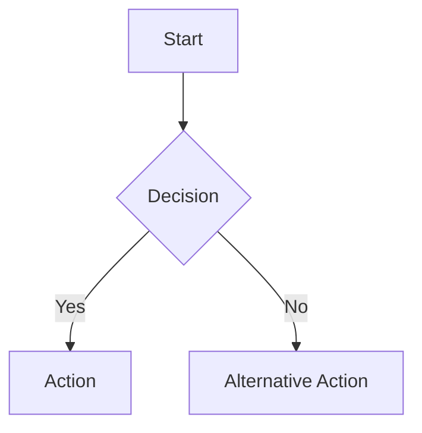

# Invoice Approval System

A monorepo for the Invoice Approval System, containing both frontend and backend code.

## Project Structure

```
.
├── apps/
│   ├── frontend/     # React frontend application
│   └── backend/      # Express backend API
├── packages/
│   └── shared/       # Shared types and utilities
└── docs/             # Project documentation
```

## Getting Started

### Prerequisites

- Node.js (v18 or later)
- npm (v10 or later)

### Installation

1. Clone the repository
2. Install dependencies:

```bash
npm install
```

### Development

To start all applications in development mode:

```bash
npm run dev
```

To start only the frontend:

```bash
npm run dev --filter=@invoice-approval/frontend
```

To start only the backend:

```bash
npm run dev --filter=@invoice-approval/backend
```

### Building

To build all applications:

```bash
npm run build
```

### Testing

To run tests for all applications:

```bash
npm run test
```

### Linting

To lint all applications:

```bash
npm run lint
```

## Tech Stack

- **Build Tools**: Turborepo, Vite
- **Frontend**: React, React Router, Tailwind CSS, DaisyUI
- **Backend**: Express, Node.js
- **Language**: TypeScript
- **Styling**: Tailwind CSS 4, DaisyUI v5
- **Testing**: Vitest, Jest
- **Linting**: ESLint, Prettier
=======
# Tinker Documentation

This repository contains documentation for the Tinker project.

## Documentation

The documentation is built using [MkDocs](https://www.mkdocs.org/) with the [Material theme](https://squidfunk.github.io/mkdocs-material/) and includes support for [Mermaid diagrams](https://mermaid.js.org/).

### Viewing Documentation Locally

To view the documentation locally:

1. Install MkDocs and the Material theme:
   ```bash
   pip install mkdocs-material
   ```

2. Serve the documentation:
   ```bash
   mkdocs serve
   ```

3. Open your browser and navigate to http://localhost:8000

### Documentation Structure

The documentation is organized as follows:

- `docs/index.md`: Home page
- `docs/1_event_storming.md`: Event Storming documentation
- `docs/2_user_journeys.md`: User Journeys documentation
- `docs/3_touch_points_screens.md`: Touch Points & Screens documentation
- `docs/4_screen_mockups.md`: Screen Mockups documentation
- `docs/5_screen_variations.md`: Screen Variations documentation
- `docs/6_summary.md`: Summary documentation
- `docs/mermaid_example.md`: Examples of Mermaid diagrams

### Using Mermaid Diagrams

You can create diagrams in your documentation using Mermaid syntax. For example:

````markdown

````

See the [Mermaid example page](docs/mermaid_example.md) for more examples.

### Automated Deployment

The documentation is automatically built and deployed to GitHub Pages when changes are pushed to the `main` branch. The deployment is handled by a GitHub Actions workflow defined in `.github/workflows/docs.yml`.

You can also manually trigger the deployment by going to the Actions tab in the GitHub repository and running the "Build and Deploy Documentation" workflow.


