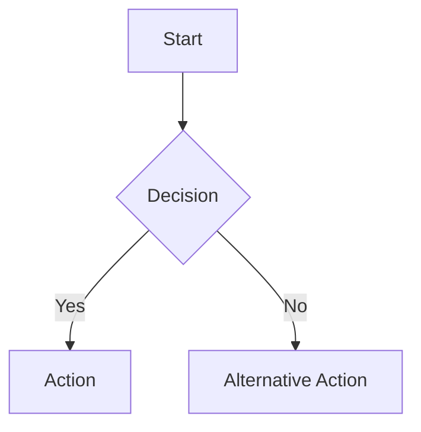

# Tinker - Invoice Approval System

A modern invoice approval system built with Hono, Drizzle ORM, better-auth, and TypeScript. This monorepo contains both frontend and backend applications with comprehensive business process tracking.

## Project Structure

```
.
├── apps/
│   ├── frontend/     # React frontend application
│   └── backend/      # Express backend API
├── packages/
│   └── shared/       # Shared types and utilities
└── docs/             # Project documentation
```

## Getting Started

### Prerequisites

- Node.js (v24 or later)
- npm (v10 or later)

### Installation

1. Clone the repository
2. Install dependencies:

```bash
npm install
```

### Development

To start all applications in development mode:

```bash
npm run dev
```

To start only the frontend:

```bash
npm run dev --filter=@invoice-approval/frontend
```

To start only the backend:

```bash
npm run dev --filter=@invoice-approval/backend
```

### Building

To build all applications:

```bash
npm run build
```

### Testing

To run tests for all applications:

```bash
npm run test
```

### Linting

To lint all applications:

```bash
npm run lint
```

## Automated PR Merging

This repository is configured with an automatic PR merging system. When a pull request passes all required checks, it will be automatically merged.

### How It Works

1. When a PR is opened, updated, or a check suite completes, the auto-merge workflow runs
2. The workflow checks if:
   - The PR is not in draft mode
   - All required checks have passed
   - The PR can be merged (no merge conflicts)
3. If all conditions are met, the PR is automatically merged

### Manual Triggering

You can manually trigger the auto-merge workflow by:

1. Going to the Actions tab in the GitHub repository
2. Selecting the "Auto Merge PRs" workflow
3. Clicking "Run workflow"

## Modern Tech Stack

### Current Implementation
- **Build Tools**: Turborepo, Vite
- **Frontend**: React, React Router, Tailwind CSS 4, DaisyUI v5
- **Language**: TypeScript
- **Testing**: Vitest, Jest
- **Linting**: ESLint, Prettier

### New Backend Stack (Implementation in Progress)
- **Backend Framework**: Hono.js - Ultrafast web framework built on Web Standards
- **Database ORM**: Drizzle ORM v0.32.1 - TypeScript-first ORM with SQLite
- **Database**: SQLite - Lightweight, serverless database
- **Authentication**: better-auth - Comprehensive TypeScript authentication library
- **Client-Server Communication**: Hono RPC - Type-safe API communication
- **Testing**: Vitest - Fast unit testing framework

### Key Benefits of New Stack
- ⚡ **Performance**: Hono's ultrafast routing with SQLite efficiency
- 🔒 **Type Safety**: End-to-end TypeScript with full type inference
- 🚀 **Developer Experience**: Auto-generated schemas, type-safe APIs, excellent tooling
- 🔐 **Authentication**: Built-in OAuth + username/password with Drizzle integration
- 📊 **Business Intelligence**: Indexed business processes with comprehensive error tracking

## Documentation

The documentation is built using [VitePress](https://vitepress.dev/) and includes support for [Mermaid diagrams](https://mermaid.js.org/).

### Viewing Documentation Locally

To view the documentation locally:

1. Install dependencies (if not already done):

   ```bash
   npm install
   ```

2. Serve the documentation:

   ```bash
   npm run docs:dev
   ```

3. Open your browser and navigate to http://localhost:5173

### Building Documentation

To build the documentation for production:

```bash
npm run docs:build
```

The built documentation will be available in `docs/.vitepress/dist/`.

### Documentation Structure

The documentation is organized as follows:

#### Implementation Guides
- **[Database Implementation Plan](docs/database-implementation.md)** - Complete database design with mermaid diagrams
- **[Technical Architecture](docs/technical-architecture.md)** - System architecture and tech stack details
- **[Development Setup](docs/development-setup.md)** - Complete development environment setup
- **[Business Processes & Error Codes](docs/business-processes.md)** - Indexed business processes with error handling

#### Domain Analysis
- `docs/1_event_storming.md`: Event Storming analysis - Domain events and business processes
- `docs/2_user_journeys.md`: User Journeys - User personas and workflows
- `docs/3_touch_points_screens.md`: Touch Points & Screens - UI interaction points
- `docs/4_screen_mockups.md`: Screen Mockups - Visual design mockups
- `docs/5_screen_variations.md`: Screen Variations - UI variations and states
- `docs/6_summary.md`: Summary - Project overview and conclusions

#### Examples & References
- `docs/index.md`: Home page
- `docs/mermaid_example.md`: Examples of Mermaid diagrams

### Using Mermaid Diagrams

You can create diagrams in your documentation using Mermaid syntax. For example:

````markdown

````

See the [Mermaid example page](docs/mermaid_example.md) for more examples.

### Automated Deployment

The documentation is automatically built and deployed to GitHub Pages when changes are pushed to the `main` branch. The deployment is handled by a GitHub Actions workflow defined in `.github/workflows/docs.yml`.

You can also manually trigger the deployment by going to the Actions tab in the GitHub repository and running the "Build and Deploy Documentation" workflow.
