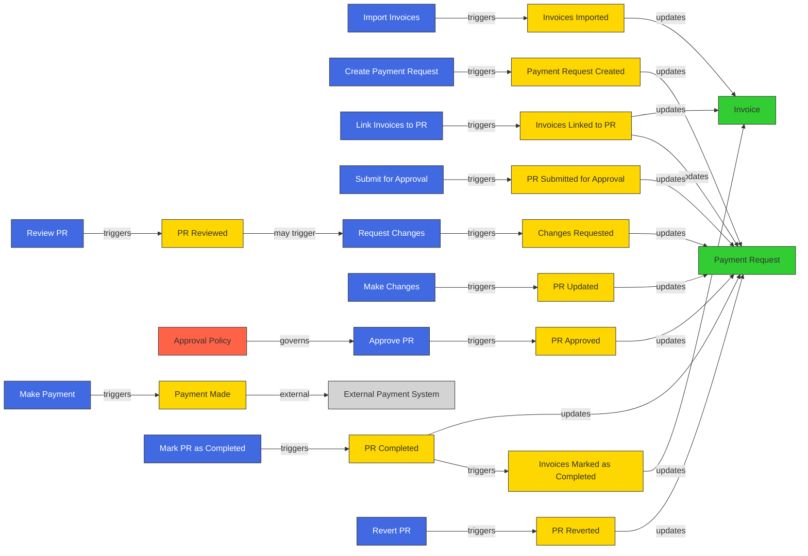

# Event Storming Analysis: Invoice Approval System

## Introduction

This document presents an Event Storming analysis of the invoice approval system. Event Storming is a workshop-based method to quickly explore complex business domains. It focuses on domain events, commands that trigger them, aggregates that encapsulate related data and behavior, and the policies that govern the system.

## Domain Events Timeline

Below is a timeline of the key domain events in the invoice approval system, from invoice import to completion.

## Key Domain Events

1. **Invoices Imported**: Batches of invoices are imported into the system.
2. **Payment Request Created**: Admin or HR creates a payment request.
3. **Invoices Linked to PR**: One or more invoices are linked to a payment request.
4. **PR Submitted for Approval**: The payment request is submitted for approval.
5. **PR Reviewed**: The payment request is reviewed by an approver.
6. **Changes Requested**: Reviewer requests changes to the payment request.
7. **PR Updated**: Changes are made to the payment request.
8. **PR Approved**: The payment request is approved (possibly through multiple stages).
9. **Payment Made**: Payment is made outside the system.
10. **PR Completed**: Finance marks the payment request as completed.
11. **Invoices Marked as Completed**: Linked invoices are marked as completed.
12. **PR Reverted**: Payment request is reverted to a previous state if needed.

## Commands

Commands are actions that trigger domain events:

1. **Import Invoices**: User imports a batch of invoices.
2. **Create Payment Request**: Admin/HR creates a new payment request.
3. **Link Invoices to PR**: User links invoices to a payment request.
4. **Submit for Approval**: User submits a payment request for approval.
5. **Review PR**: Approver reviews a payment request.
6. **Request Changes**: Approver requests changes to a payment request.
7. **Make Changes**: User makes changes to a payment request.
8. **Approve PR**: Approver approves a payment request.
9. **Make Payment**: Finance makes payment (external to the system).
10. **Mark PR as Completed**: Finance marks a payment request as completed.
11. **Revert PR**: Admin reverts a payment request to a previous state.

## Aggregates

Aggregates are clusters of domain objects that can be treated as a single unit:

1. **Invoice**: Represents an invoice in the system.
   - Properties: ID, Amount, Date, Vendor, Status (Imported, Linked, Completed, Obsolete)
   - Behaviors: Link to PR, Mark as Completed, Mark as Obsolete

2. **Payment Request**: Represents a payment request in the system.
   - Properties: ID, Total Amount, Date, Status (Draft, In Review, Approved, Completed), Linked Invoices, Approval History
   - Behaviors: Link Invoices, Submit for Approval, Update, Approve, Complete, Revert

## Policies

Policies are business rules that govern the system:

1. **Approval Policy**: Determines the approval workflow for a payment request.
   - Different payment requests may have different approval routes.
   - May include multiple approval stages.
   - May include rules based on amount thresholds, departments, etc.

## External Systems

1. **External Payment System**: The system where actual payments are processed (outside the scope of this system).

## State Changes

### Invoice States
- **Imported**: Initial state when an invoice is imported into the system.
- **Linked**: Invoice is linked to a payment request.
- **Completed**: Invoice is marked as completed after the linked payment request is completed.
- **Obsolete**: Invoice is marked as obsolete (no longer valid).

### Payment Request States
- **Draft**: Initial state when a payment request is created.
- **In Review**: Payment request is submitted for approval and under review.
- **Approved**: Payment request has been approved.
- **Completed**: Payment has been made and the payment request is marked as completed.

## Hotspots and Questions

During the Event Storming analysis, several hotspots (areas of uncertainty or complexity) were identified:

1. **Approval Workflow Complexity**: How complex can the approval workflows be? Can they be dynamic based on certain criteria?
2. **Reverting Completed PRs**: What are the business rules for reverting a completed payment request?
3. **Partial Payments**: Is it possible to make partial payments against a payment request?
4. **Batch Processing**: How are batches of invoices handled? Are there any special considerations?
5. **Audit Requirements**: What audit trail is required for compliance purposes?

## Conclusion

This Event Storming analysis provides a high-level overview of the invoice approval system domain. It identifies the key events, commands, aggregates, and policies that govern the system. This analysis will serve as a foundation for the subsequent user journey mapping and screen design.

