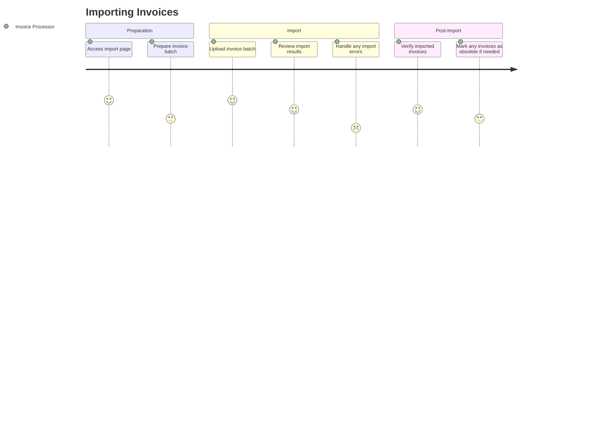
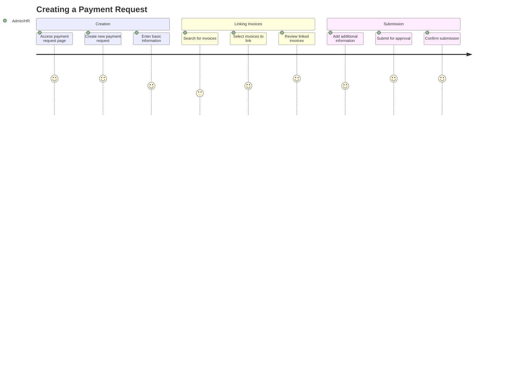
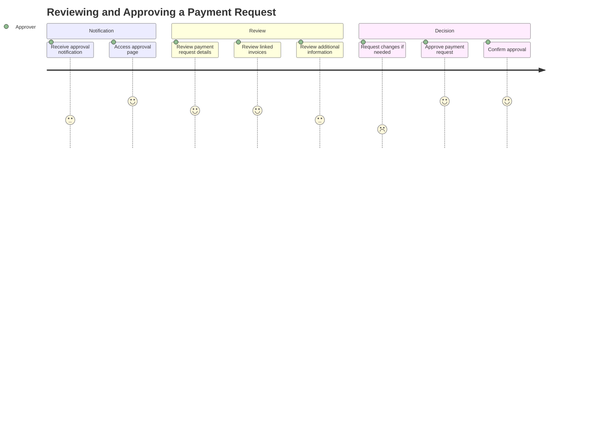
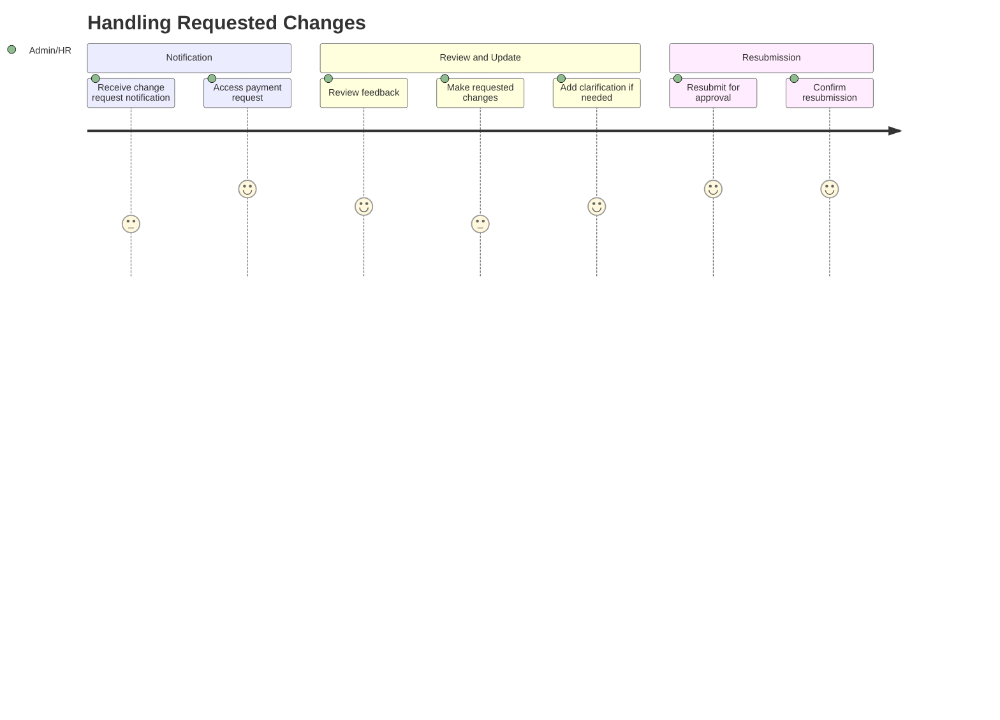
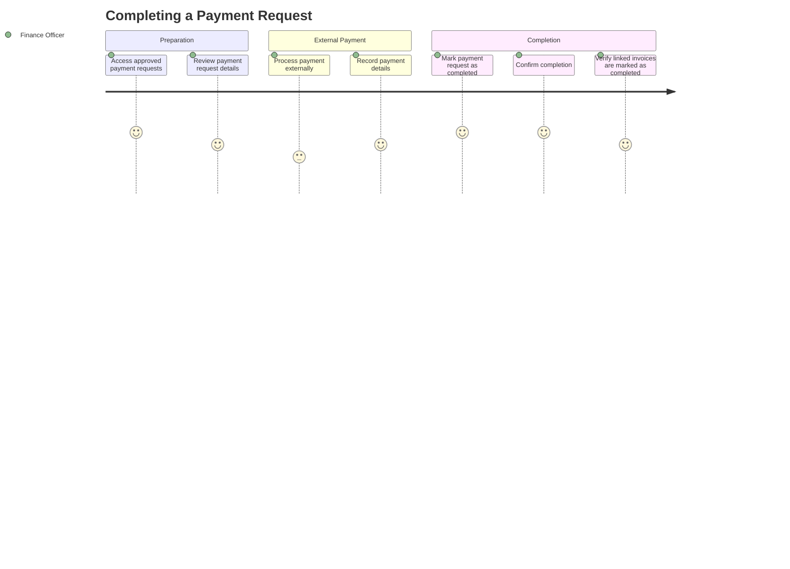
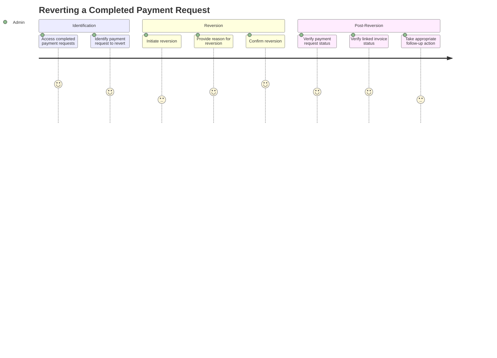

# User Journeys: Invoice Approval System

## Introduction

This document outlines the key user journeys in the invoice approval system. User journeys map out the sequence of steps that different users take to accomplish their goals within the system. These journeys are aligned with the domain events identified in the Event Storming analysis.

## User Personas

### 1. Invoice Processor
- **Role**: Responsible for importing invoices into the system
- **Goals**: Efficiently import and manage invoices
- **Pain Points**: Handling large batches, identifying duplicates, correcting errors

### 2. Payment Request Creator (Admin/HR)
- **Role**: Creates and manages payment requests
- **Goals**: Create payment requests, link invoices, submit for approval
- **Pain Points**: Tracking approval status, managing rejections

### 3. Approver
- **Role**: Reviews and approves payment requests
- **Goals**: Efficiently review requests, provide feedback, approve valid requests
- **Pain Points**: Lack of context, unclear approval criteria

### 4. Finance Officer
- **Role**: Processes payments and completes payment requests
- **Goals**: Track approved requests, mark payments as completed
- **Pain Points**: Reconciling payments with external systems

## User Journeys

### Journey 1: Importing Invoices

**User**: Invoice Processor

**Steps**:
1. **Access Import Page**: User navigates to the invoice import page.
2. **Prepare Invoice Batch**: User prepares the batch of invoices for import.
3. **Upload Invoice Batch**: User uploads the batch of invoices.
4. **Review Import Results**: User reviews the results of the import, including any errors or warnings.
5. **Handle Import Errors**: If there are any errors, user corrects them and re-imports if necessary.
6. **Verify Imported Invoices**: User verifies that all invoices have been imported correctly.
7. **Mark Obsolete Invoices**: If any invoices are no longer valid, user marks them as obsolete.

**Success Criteria**:
- All valid invoices are successfully imported into the system.
- Any invalid or duplicate invoices are identified and handled appropriately.

### Journey 2: Creating a Payment Request

**User**: Payment Request Creator (Admin/HR)

**Steps**:
1. **Access Payment Request Page**: User navigates to the payment request creation page.
2. **Create New Payment Request**: User initiates the creation of a new payment request.
3. **Enter Basic Information**: User enters basic information about the payment request (e.g., description, date).
4. **Search for Invoices**: User searches for invoices to link to the payment request.
5. **Select Invoices to Link**: User selects one or more invoices to link to the payment request.
6. **Review Linked Invoices**: User reviews the invoices linked to the payment request.
7. **Add Additional Information**: User adds any additional information required for the payment request.
8. **Submit for Approval**: User submits the payment request for approval.
9. **Confirm Submission**: User confirms the submission and receives confirmation.

**Success Criteria**:
- Payment request is created with all required information.
- Appropriate invoices are linked to the payment request.
- Payment request is successfully submitted for approval.

### Journey 3: Reviewing and Approving a Payment Request

**User**: Approver

**Steps**:
1. **Receive Approval Notification**: User receives notification that a payment request requires their approval.
2. **Access Approval Page**: User navigates to the approval page for the payment request.
3. **Review Payment Request Details**: User reviews the details of the payment request.
4. **Review Linked Invoices**: User reviews the invoices linked to the payment request.
5. **Review Additional Information**: User reviews any additional information provided.
6. **Request Changes (if needed)**: If changes are needed, user requests changes and provides feedback.
7. **Approve Payment Request**: If the payment request is valid, user approves it.
8. **Confirm Approval**: User confirms the approval and receives confirmation.

**Success Criteria**:
- Approver has all necessary information to make an informed decision.
- Feedback is provided if changes are requested.
- Payment request is approved if it meets all criteria.

### Journey 4: Handling Requested Changes

**User**: Payment Request Creator (Admin/HR)

**Steps**:
1. **Receive Change Request Notification**: User receives notification that changes have been requested for a payment request.
2. **Access Payment Request**: User navigates to the payment request that requires changes.
3. **Review Feedback**: User reviews the feedback provided by the approver.
4. **Make Requested Changes**: User makes the changes requested by the approver.
5. **Add Clarification**: User adds any clarification or additional information if needed.
6. **Resubmit for Approval**: User resubmits the payment request for approval.
7. **Confirm Resubmission**: User confirms the resubmission and receives confirmation.

**Success Criteria**:
- All requested changes are addressed.
- Payment request is successfully resubmitted for approval.

### Journey 5: Completing a Payment Request

**User**: Finance Officer

**Steps**:
1. **Access Approved Payment Requests**: User navigates to the list of approved payment requests.
2. **Review Payment Request Details**: User reviews the details of the payment request to be processed.
3. **Process Payment Externally**: User processes the payment using an external system.
4. **Record Payment Details**: User records the details of the payment (e.g., date, reference number).
5. **Mark Payment Request as Completed**: User marks the payment request as completed.
6. **Confirm Completion**: User confirms the completion and receives confirmation.
7. **Verify Linked Invoices**: User verifies that all linked invoices are automatically marked as completed.

**Success Criteria**:
- Payment request is successfully marked as completed.
- All linked invoices are automatically marked as completed.
- Payment details are recorded for future reference.

### Journey 6: Reverting a Completed Payment Request

**User**: Admin/HR or Finance Officer

**Steps**:
1. **Access Completed Payment Requests**: User navigates to the list of completed payment requests.
2. **Identify Payment Request**: User identifies the payment request to be reverted.
3. **Initiate Reversion**: User initiates the reversion process.
4. **Provide Reason**: User provides a reason for the reversion.
5. **Confirm Reversion**: User confirms the reversion and receives confirmation.
6. **Verify Payment Request Status**: User verifies that the payment request status has been reverted.
7. **Verify Linked Invoice Status**: User verifies that the status of linked invoices has been updated appropriately.
8. **Take Follow-up Action**: User takes any necessary follow-up action based on the reason for reversion.

**Success Criteria**:
- Payment request is successfully reverted to the appropriate state.
- Linked invoices are updated appropriately.
- Reason for reversion is recorded for audit purposes.

## Journey Map Verification

The user journeys outlined above have been verified against the Event Storming analysis to ensure that all domain events are covered:

| Domain Event | User Journey |
|--------------|--------------|
| Invoices Imported | Journey 1: Importing Invoices |
| Payment Request Created | Journey 2: Creating a Payment Request |
| Invoices Linked to PR | Journey 2: Creating a Payment Request |
| PR Submitted for Approval | Journey 2: Creating a Payment Request |
| PR Reviewed | Journey 3: Reviewing and Approving a Payment Request |
| Changes Requested | Journey 3: Reviewing and Approving a Payment Request |
| PR Updated | Journey 4: Handling Requested Changes |
| PR Approved | Journey 3: Reviewing and Approving a Payment Request |
| Payment Made | Journey 5: Completing a Payment Request |
| PR Completed | Journey 5: Completing a Payment Request |
| Invoices Marked as Completed | Journey 5: Completing a Payment Request |
| PR Reverted | Journey 6: Reverting a Completed Payment Request |

## Conclusion

This document outlines the key user journeys in the invoice approval system. These journeys provide a user-centric view of the system and will inform the design of the user interface and interactions. The next step is to extract touch points and define the screens needed to support these journeys.

