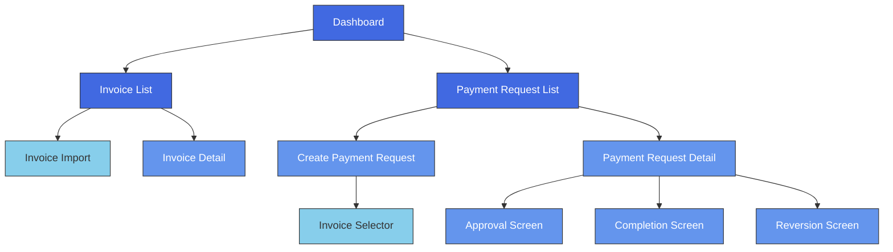
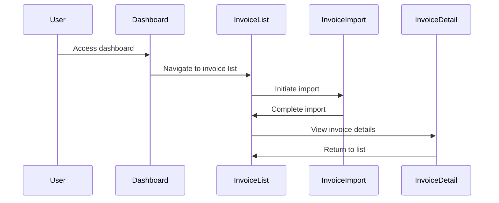
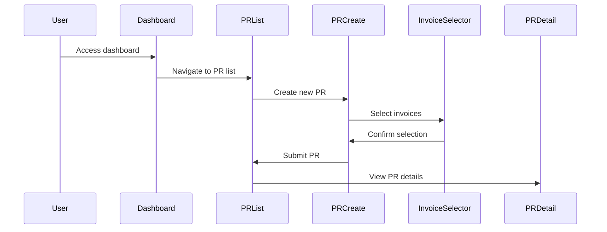
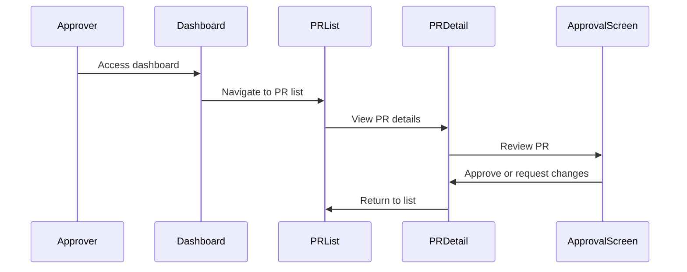
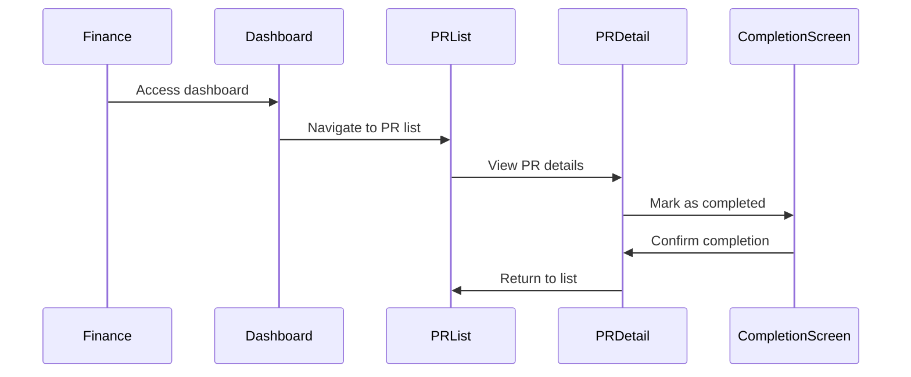

# Touch Points and Screens: Invoice Approval System

## Introduction

This document identifies and describes the key touch points and screens in the invoice approval system. These screens are derived from the user journeys and domain events identified in the previous documents. Each screen is described in terms of its purpose, key elements, user actions, and relationship to domain events and user journeys.

## Screen Map

The following diagram shows the relationship between the main screens in the system:

## Screen Descriptions

### 1. Dashboard

**Purpose**: Provide an overview of the system and quick access to main functions.

**Key Elements**:
- Summary statistics (e.g., pending invoices, payment requests awaiting approval)
- Quick links to main sections
- Recent activity feed
- User notifications

**User Actions**:
- Navigate to Invoice List
- Navigate to Payment Request List
- View notifications
- View recent activity

**Related User Journeys**: All journeys start here.

**Related Domain Events**: None directly, but provides visibility into the state of the system.

### 2. Invoice List

**Purpose**: Display and manage all invoices in the system.

**Key Elements**:
- Filterable and sortable list of invoices
- Invoice status indicators (Imported, Linked, Completed, Obsolete)
- Search functionality
- Batch actions

**User Actions**:
- Import invoices
- View invoice details
- Search and filter invoices
- Mark invoices as obsolete
- Export invoice data

**Related User Journeys**: Journey 1: Importing Invoices

**Related Domain Events**: Invoices Imported, Invoices Marked as Obsolete

### 3. Invoice Import

**Purpose**: Import batches of invoices into the system.

**Key Elements**:
- File upload interface
- Import options
- Validation results
- Error handling

**User Actions**:
- Select and upload file
- Configure import options
- Review validation results
- Confirm import
- Handle errors

**Related User Journeys**: Journey 1: Importing Invoices

**Related Domain Events**: Invoices Imported

### 4. Invoice Detail

**Purpose**: View and manage details of a specific invoice.

**Key Elements**:
- Invoice information (ID, amount, date, vendor, etc.)
- Status and history
- Linked payment requests
- Actions based on current status

**User Actions**:
- Edit invoice details (if allowed)
- Mark as obsolete
- View linked payment requests
- Export invoice

**Related User Journeys**: Journey 1: Importing Invoices

**Related Domain Events**: Invoice Updated, Invoice Marked as Obsolete

### 5. Payment Request List

**Purpose**: Display and manage all payment requests in the system.

**Key Elements**:
- Filterable and sortable list of payment requests
- Status indicators (Draft, In Review, Approved, Completed)
- Search functionality
- Actions based on user role

**User Actions**:
- Create new payment request
- View payment request details
- Search and filter payment requests
- Export payment request data

**Related User Journeys**: Journey 2: Creating a Payment Request, Journey 5: Completing a Payment Request

**Related Domain Events**: Payment Request Created

### 6. Create Payment Request

**Purpose**: Create a new payment request and link invoices.

**Key Elements**:
- Basic information form
- Invoice selector
- Summary of selected invoices
- Submission controls

**User Actions**:
- Enter payment request information
- Select invoices to link
- Review and adjust
- Submit for approval

**Related User Journeys**: Journey 2: Creating a Payment Request

**Related Domain Events**: Payment Request Created, Invoices Linked to PR, PR Submitted for Approval

### 7. Invoice Selector

**Purpose**: Select invoices to link to a payment request.

**Key Elements**:
- Filterable and searchable list of available invoices
- Selection mechanism
- Summary of selected invoices
- Confirmation controls

**User Actions**:
- Search and filter invoices
- Select/deselect invoices
- Confirm selection

**Related User Journeys**: Journey 2: Creating a Payment Request

**Related Domain Events**: Invoices Linked to PR

### 8. Payment Request Detail

**Purpose**: View and manage details of a specific payment request.

**Key Elements**:
- Payment request information
- Status and history
- Linked invoices
- Approval status
- Actions based on current status and user role

**User Actions**:
- Edit (if in Draft status)
- Submit for approval (if in Draft status)
- View approval status
- Mark as completed (Finance role, if Approved)
- Revert (if Completed)

**Related User Journeys**: Journey 2: Creating a Payment Request, Journey 4: Handling Requested Changes, Journey 5: Completing a Payment Request, Journey 6: Reverting a Completed Payment Request

**Related Domain Events**: PR Updated, PR Submitted for Approval, PR Completed, PR Reverted

### 9. Approval Screen

**Purpose**: Review and approve or request changes to a payment request.

**Key Elements**:
- Payment request details
- Linked invoice details
- Approval history
- Comment/feedback section
- Approval controls

**User Actions**:
- Review details
- Add comments/feedback
- Request changes
- Approve
- Reject

**Related User Journeys**: Journey 3: Reviewing and Approving a Payment Request

**Related Domain Events**: PR Reviewed, Changes Requested, PR Approved

### 10. Completion Screen

**Purpose**: Mark a payment request as completed after payment has been made.

**Key Elements**:
- Payment request details
- Payment information form
- Confirmation controls

**User Actions**:
- Enter payment details
- Mark as completed
- Confirm completion

**Related User Journeys**: Journey 5: Completing a Payment Request

**Related Domain Events**: PR Completed, Invoices Marked as Completed

### 11. Reversion Screen

**Purpose**: Revert a completed payment request to a previous state.

**Key Elements**:
- Payment request details
- Reason for reversion form
- Confirmation controls

**User Actions**:
- Enter reason for reversion
- Select state to revert to
- Confirm reversion

**Related User Journeys**: Journey 6: Reverting a Completed Payment Request

**Related Domain Events**: PR Reverted

## Touch Points by User Role

### Invoice Processor
- Dashboard
- Invoice List
- Invoice Import
- Invoice Detail

### Payment Request Creator (Admin/HR)
- Dashboard
- Invoice List
- Invoice Detail
- Payment Request List
- Create Payment Request
- Invoice Selector
- Payment Request Detail

### Approver
- Dashboard
- Payment Request List
- Payment Request Detail
- Approval Screen

### Finance Officer
- Dashboard
- Payment Request List
- Payment Request Detail
- Completion Screen
- Reversion Screen

## Screen Flow Diagrams

### Invoice Management Flow

### Payment Request Creation Flow

### Approval Flow

### Completion Flow

## Conclusion

This document outlines the key screens and touch points in the invoice approval system. These screens are designed to support the user journeys identified in the previous document and to facilitate the domain events identified in the Event Storming analysis. The next step is to create mockups for these screens to visualize the user interface.

