# Business Processes & Error Codes

## Overview

This document defines the complete business process index and error code system for the invoice approval system, based on the eventstorming analysis.

## Business Process Index

Each business process is assigned a unique two-digit index number for tracking, logging, and error reporting.

```mermaid
flowchart TD
    A[Business Processes] --> B[01: Import Invoices]
    A --> C[02: Create Payment Request]
    A --> D[03: Link Invoices to PR]
    A --> E[04: Submit for Approval]
    A --> F[05: Review Payment Request]
    A --> G[06: Request Changes]
    A --> H[07: Make Changes]
    A --> I[08: Approve Payment Request]
    A --> J[09: Make Payment]
    A --> K[10: Mark as Completed]
    A --> L[11: Revert Payment Request]
    A --> M[12: User Authentication]
    A --> N[13: User Authorization]
    A --> O[14: Data Validation]
    A --> P[15: System Integration]
```

## Process Definitions

### 01: Import Invoices

**Description**: Batch import of invoices into the system  
**Trigger**: User uploads invoice file  
**Actor**: Invoice Processor  
**Outcome**: Invoices created with "imported" status

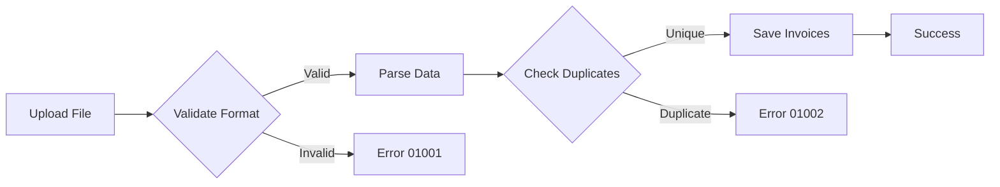

**Error Codes**:

- `01001`: Invalid file format
- `01002`: Duplicate invoice detected
- `01003`: Missing required fields
- `01004`: Invalid amount format
- `01005`: Invalid date format
- `01006`: Vendor not found
- `01007`: Batch size exceeded
- `01008`: File size too large
- `01009`: Parsing error
- `01010`: Database save failed

### 02: Create Payment Request

**Description**: Create a new payment request  
**Trigger**: User initiates payment request creation  
**Actor**: Payment Request Creator (Admin/HR)  
**Outcome**: Payment request created with "draft" status

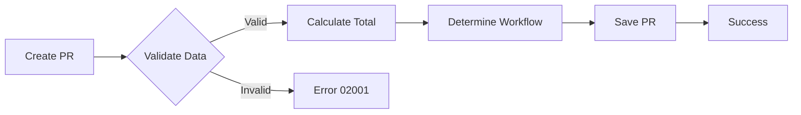

**Error Codes**:

- `02001`: Insufficient permissions
- `02002`: Invalid amount
- `02003`: Invalid date
- `02004`: Missing required fields
- `02005`: Workflow determination failed
- `02006`: Database save failed
- `02007`: User not found
- `02008`: Invalid approval route
- `02009`: Duplicate payment request
- `02010`: System configuration error

### 03: Link Invoices to Payment Request

**Description**: Associate invoices with a payment request  
**Trigger**: User selects invoices to link  
**Actor**: Payment Request Creator  
**Outcome**: Invoices linked to payment request

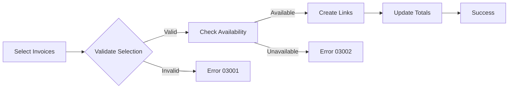

**Error Codes**:

- `03001`: Invoice already linked
- `03002`: Invoice not found
- `03003`: Invoice in wrong status
- `03004`: Permission denied
- `03005`: Payment request not in draft status
- `03006`: Maximum invoices exceeded
- `03007`: Total amount mismatch
- `03008`: Database update failed
- `03009`: Concurrent modification detected
- `03010`: Invalid invoice selection

### 04: Submit for Approval

**Description**: Submit payment request for approval workflow  
**Trigger**: User submits payment request  
**Actor**: Payment Request Creator  
**Outcome**: Payment request status changed to "in_review"

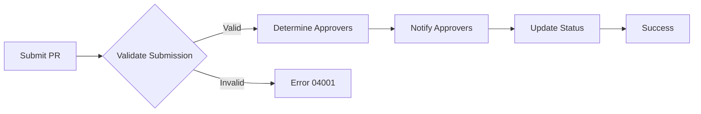

**Error Codes**:

- `04001`: No invoices linked
- `04002`: Invalid approval workflow
- `04003`: Approver not available
- `04004`: Payment request not in draft status
- `04005`: Insufficient data for approval
- `04006`: Notification failed
- `04007`: Status update failed
- `04008`: Workflow configuration error
- `04009`: Permission denied
- `04010`: System unavailable

### 05: Review Payment Request

**Description**: Approver reviews payment request  
**Trigger**: Approver accesses payment request  
**Actor**: Approver  
**Outcome**: Review session initiated

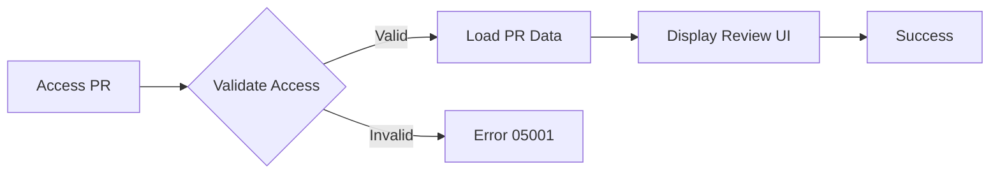

**Error Codes**:

- `05001`: Access denied
- `05002`: Payment request not found
- `05003`: Not assigned approver
- `05004`: Payment request not in review status
- `05005`: Review session expired
- `05006`: Data loading failed
- `05007`: Concurrent review detected
- `05008`: System error
- `05009`: Invalid approver status
- `05010`: Review workflow error

### 06: Request Changes

**Description**: Approver requests changes to payment request  
**Trigger**: Approver clicks "Request Changes"  
**Actor**: Approver  
**Outcome**: Payment request returned to creator with feedback

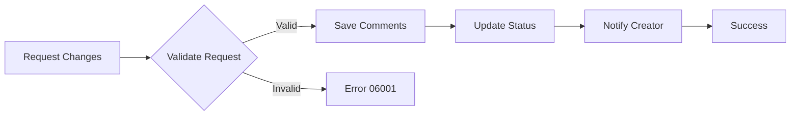

**Error Codes**:

- `06001`: Comments required
- `06002`: Invalid status transition
- `06003`: Permission denied
- `06004`: Notification failed
- `06005`: Database update failed
- `06006`: Concurrent modification
- `06007`: Invalid approver
- `06008`: System error
- `06009`: Workflow violation
- `06010`: Change request limit exceeded

### 07: Make Changes

**Description**: Creator makes requested changes to payment request  
**Trigger**: Creator modifies payment request  
**Actor**: Payment Request Creator  
**Outcome**: Payment request updated and ready for resubmission

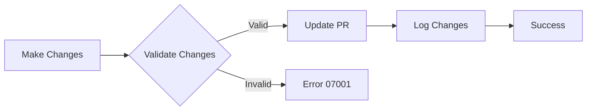

**Error Codes**:

- `07001`: Invalid modifications
- `07002`: Permission denied
- `07003`: Payment request locked
- `07004`: Database update failed
- `07005`: Validation failed
- `07006`: Concurrent modification
- `07007`: Change limit exceeded
- `07008`: System error
- `07009`: Invalid status for changes
- `07010`: Audit log failed

### 08: Approve Payment Request

**Description**: Approver approves payment request  
**Trigger**: Approver clicks "Approve"  
**Actor**: Approver  
**Outcome**: Payment request approved (may trigger next approval stage)

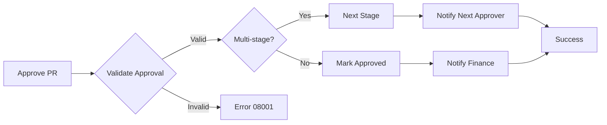

**Error Codes**:

- `08001`: Approval validation failed
- `08002`: Permission denied
- `08003`: Invalid approver
- `08004`: Payment request not in review
- `08005`: Workflow error
- `08006`: Database update failed
- `08007`: Notification failed
- `08008`: Concurrent approval detected
- `08009`: System error
- `08010`: Approval limit exceeded

### 09: Make Payment

**Description**: External payment processing  
**Trigger**: Finance initiates payment  
**Actor**: Finance Officer  
**Outcome**: Payment processed in external system

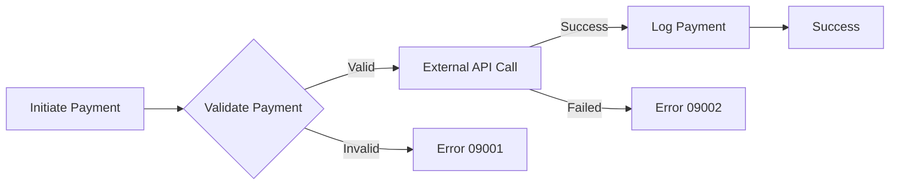

**Error Codes**:

- `09001`: Payment validation failed
- `09002`: External system error
- `09003`: Insufficient funds
- `09004`: Payment already processed
- `09005`: Invalid payment details
- `09006`: API connection failed
- `09007`: Authentication failed
- `09008`: Payment limit exceeded
- `09009`: System unavailable
- `09010`: Transaction timeout

### 10: Mark as Completed

**Description**: Mark payment request as completed  
**Trigger**: Finance confirms payment completion  
**Actor**: Finance Officer  
**Outcome**: Payment request and linked invoices marked as completed

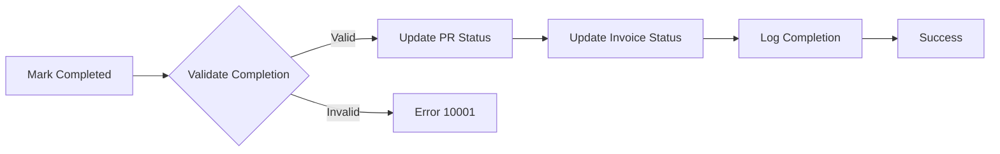

**Error Codes**:

- `10001`: Payment not confirmed
- `10002`: Permission denied
- `10003`: Invalid status transition
- `10004`: Database update failed
- `10005`: Concurrent modification
- `10006`: System error
- `10007`: Audit log failed
- `10008`: Notification failed
- `10009`: Completion validation failed
- `10010`: Workflow violation

### 11: Revert Payment Request

**Description**: Revert payment request to previous state  
**Trigger**: Admin initiates revert  
**Actor**: Admin  
**Outcome**: Payment request reverted with audit trail

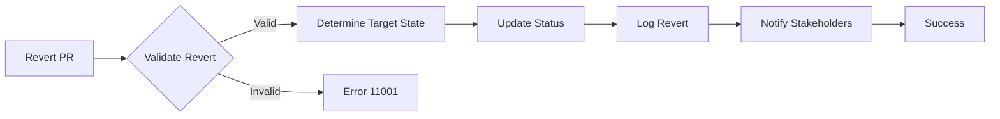

**Error Codes**:

- `11001`: Revert not allowed
- `11002`: Permission denied
- `11003`: Invalid target state
- `11004`: Database update failed
- `11005`: Concurrent modification
- `11006`: System error
- `11007`: Audit log failed
- `11008`: Notification failed
- `11009`: Revert limit exceeded
- `11010`: Workflow violation

### 12: User Authentication

**Description**: User login and session management  
**Trigger**: User attempts to log in  
**Actor**: Any User  
**Outcome**: User authenticated and session created

**Error Codes**:

- `12001`: Invalid credentials
- `12002`: Account locked
- `12003`: Account not verified
- `12004`: Session creation failed
- `12005`: OAuth provider error
- `12006`: Token validation failed
- `12007`: Session expired
- `12008`: Too many login attempts
- `12009`: System unavailable
- `12010`: Authentication service error

### 13: User Authorization

**Description**: Check user permissions for actions  
**Trigger**: User attempts protected action  
**Actor**: Any User  
**Outcome**: Permission granted or denied

**Error Codes**:

- `13001`: Insufficient permissions
- `13002`: Role not found
- `13003`: Permission check failed
- `13004`: User not found
- `13005`: Invalid session
- `13006`: Authorization service error
- `13007`: Permission expired
- `13008`: System error
- `13009`: Access denied
- `13010`: Authorization timeout

### 14: Data Validation

**Description**: Validate input data across the system  
**Trigger**: Data submission or update  
**Actor**: System  
**Outcome**: Data validated or rejected

**Error Codes**:

- `14001`: Required field missing
- `14002`: Invalid data format
- `14003`: Data type mismatch
- `14004`: Value out of range
- `14005`: Invalid relationship
- `14006`: Constraint violation
- `14007`: Schema validation failed
- `14008`: Business rule violation
- `14009`: Data integrity error
- `14010`: Validation service error

### 15: System Integration

**Description**: Integration with external systems  
**Trigger**: System-to-system communication  
**Actor**: System  
**Outcome**: Integration successful or failed

**Error Codes**:

- `15001`: External service unavailable
- `15002`: API rate limit exceeded
- `15003`: Authentication failed
- `15004`: Data format mismatch
- `15005`: Timeout error
- `15006`: Network error
- `15007`: Configuration error
- `15008`: Version mismatch
- `15009`: Integration service error
- `15010`: Data synchronization failed

## Error Code Structure

### Format

```
PPXXX
```

Where:

- `PP`: Process index (01-15)
- `XXX`: Specific error code (001-010)

### Error Response Format

```json
{
  "success": false,
  "error": {
    "code": "01001",
    "message": "Invalid file format",
    "details": "The uploaded file must be in CSV or Excel format",
    "processIndex": 1,
    "processName": "Import Invoices",
    "timestamp": "2024-01-15T10:30:00Z",
    "requestId": "req_123456789"
  }
}
```

### Error Severity Levels

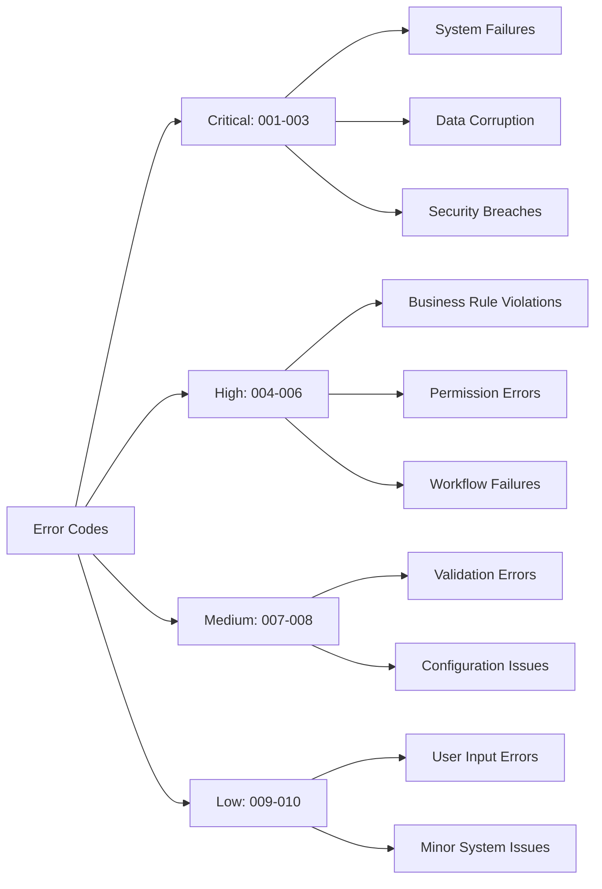

## Business Process Logging

### Log Entry Structure

```typescript
interface BusinessProcessLog {
  id: string;
  processIndex: number;
  processName: string;
  entityType: string;
  entityId: string;
  status: 'started' | 'completed' | 'failed';
  errorCode?: string;
  details: Record<string, any>;
  userId?: string;
  duration?: number;
  createdAt: Date;
}
```

### Example Log Entries

```json
[
  {
    "id": "log_001",
    "processIndex": 1,
    "processName": "Import Invoices",
    "entityType": "invoice_batch",
    "entityId": "batch_001",
    "status": "started",
    "details": {
      "fileName": "invoices_jan_2024.csv",
      "fileSize": 1024000,
      "expectedCount": 150
    },
    "userId": "user_123",
    "createdAt": "2024-01-15T10:30:00Z"
  },
  {
    "id": "log_002",
    "processIndex": 1,
    "processName": "Import Invoices",
    "entityType": "invoice_batch",
    "entityId": "batch_001",
    "status": "failed",
    "errorCode": "01002",
    "details": {
      "duplicateCount": 5,
      "duplicateInvoices": [
        "inv_001",
        "inv_002",
        "inv_003",
        "inv_004",
        "inv_005"
      ]
    },
    "userId": "user_123",
    "duration": 5000,
    "createdAt": "2024-01-15T10:30:05Z"
  }
]
```

## Monitoring and Alerting

### Process Monitoring Dashboard

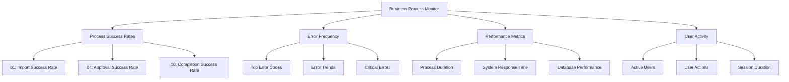

### Alert Conditions

| Condition                         | Severity | Action                       |
| --------------------------------- | -------- | ---------------------------- |
| Error rate > 10% for any process  | High     | Immediate notification       |
| Critical error (001-003) occurs   | Critical | Page on-call engineer        |
| Process duration > 5x average     | Medium   | Log for investigation        |
| Authentication failures > 50/hour | High     | Security team notification   |
| System integration failures       | High     | Operations team notification |

## Implementation Guidelines

### Error Handling Best Practices

1. **Consistent Error Format**: Always use the standard error response format
2. **Meaningful Messages**: Provide clear, actionable error messages
3. **Proper Logging**: Log all errors with sufficient context
4. **User-Friendly**: Don't expose internal system details to users
5. **Monitoring**: Track error patterns and trends

### Code Example

```typescript
// Business process error handling
export class BusinessProcessError extends Error {
  constructor(
    public processIndex: number,
    public errorCode: string,
    public message: string,
    public details?: Record<string, any>
  ) {
    super(message);
    this.name = 'BusinessProcessError';
  }
}

// Usage in service
export async function importInvoices(data: InvoiceImportData, userId: string) {
  const processIndex = 1;

  try {
    // Log process start
    await logBusinessProcess({
      processIndex,
      entityType: 'invoice_batch',
      entityId: data.batchId,
      status: 'started',
      userId,
      details: { fileName: data.fileName, expectedCount: data.invoices.length },
    });

    // Validate file format
    if (!isValidFormat(data.fileName)) {
      throw new BusinessProcessError(
        processIndex,
        '01001',
        'Invalid file format',
        { fileName: data.fileName, supportedFormats: ['csv', 'xlsx'] }
      );
    }

    // Process invoices...
    const result = await processInvoices(data);

    // Log success
    await logBusinessProcess({
      processIndex,
      entityType: 'invoice_batch',
      entityId: data.batchId,
      status: 'completed',
      userId,
      details: { processedCount: result.length },
    });

    return result;
  } catch (error) {
    // Log failure
    await logBusinessProcess({
      processIndex,
      entityType: 'invoice_batch',
      entityId: data.batchId,
      status: 'failed',
      errorCode:
        error instanceof BusinessProcessError ? error.errorCode : '01009',
      userId,
      details: { error: error.message },
    });

    throw error;
  }
}
```

This comprehensive business process and error code system provides a solid foundation for tracking, monitoring, and debugging the invoice approval system.
