# Database Implementation Plan: Invoice Approval System

## Overview

This document outlines the comprehensive database implementation plan for the Tinker invoice approval system, transitioning from Express.js to a modern tech stack with Hono, Drizzle ORM, SQLite, and better-auth.

## Tech Stack

### Core Technologies
- **Backend Framework**: Hono.js (latest) - Ultrafast web framework built on Web Standards
- **Database ORM**: Drizzle ORM v0.32.1 - TypeScript-first ORM with SQLite support
- **Database**: SQLite - Lightweight, serverless database
- **Authentication**: better-auth - Comprehensive TypeScript authentication library
- **Client-Server Communication**: Hono RPC - Type-safe API communication
- **Testing**: Vitest - Fast unit testing framework

### Key Benefits
- **Type Safety**: End-to-end TypeScript with full type inference
- **Performance**: Hono's ultrafast routing with SQLite's efficiency
- **Developer Experience**: Auto-generated schemas, type-safe APIs, excellent tooling
- **Authentication**: Built-in OAuth + username/password with Drizzle integration

## Database Architecture

### Domain Model Overview

Based on our eventstorming analysis, the system revolves around two main aggregates:

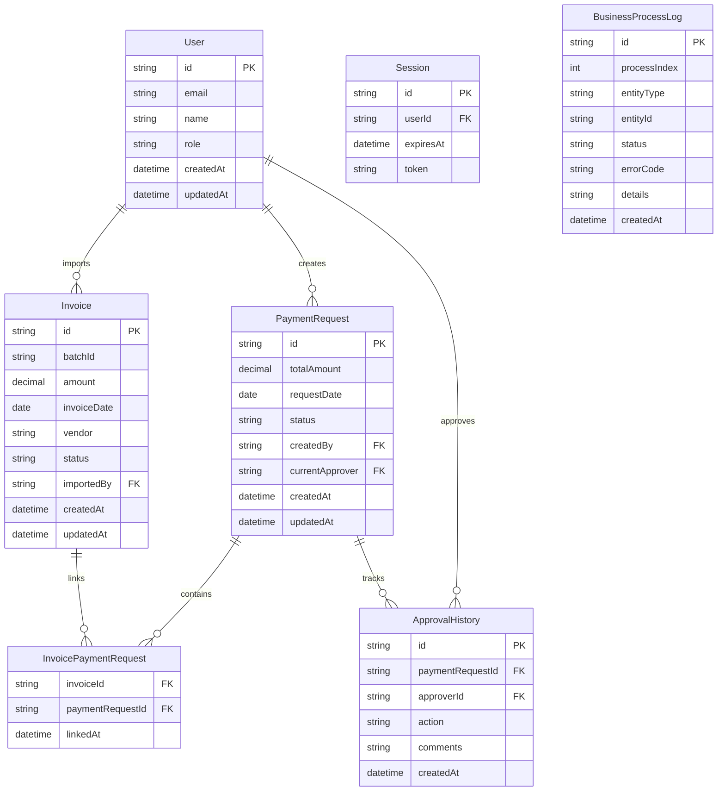

### State Management

#### Invoice States
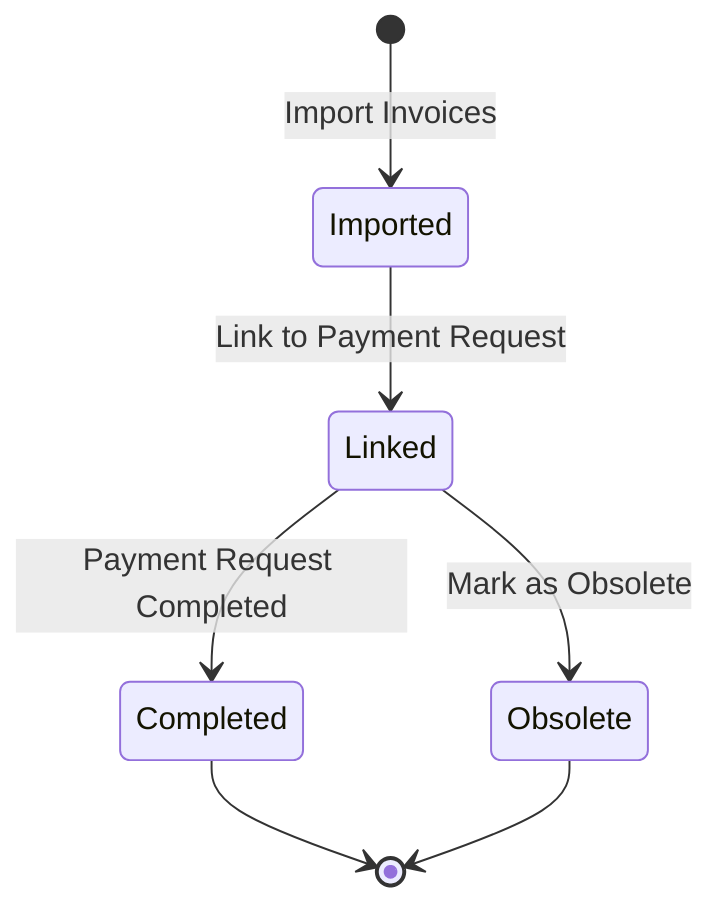

#### Payment Request States
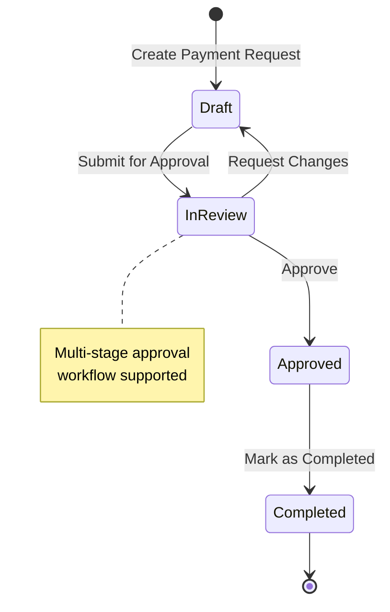

## Business Process Index & Error Codes

### Process Index System

Each business operation is assigned a unique index number for tracking and error reporting:

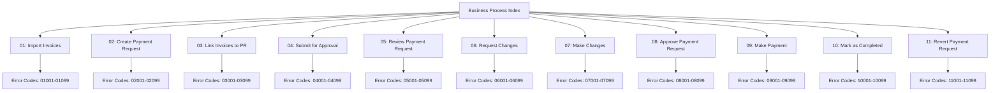

### Error Code Structure

Format: `PPXXX` where:
- `PP`: Process index (01-11)
- `XXX`: Specific error code (001-099)

#### Example Error Codes

| Process | Error Code | Description |
|---------|------------|-------------|
| 01 (Import) | 01001 | Invalid file format |
| 01 (Import) | 01002 | Duplicate invoice detected |
| 01 (Import) | 01003 | Missing required fields |
| 02 (Create PR) | 02001 | Insufficient permissions |
| 02 (Create PR) | 02002 | Invalid amount |
| 03 (Link) | 03001 | Invoice already linked |
| 03 (Link) | 03002 | Invoice not found |
| 04 (Submit) | 04001 | No invoices linked |
| 04 (Submit) | 04002 | Invalid approval workflow |

## Authentication & Authorization

### better-auth Integration

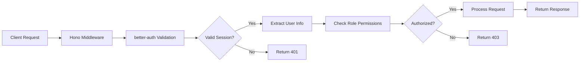

### User Roles & Permissions

| Role | Permissions |
|------|-------------|
| **Invoice Processor** | Import invoices, view invoice status |
| **Payment Request Creator** | Create PRs, link invoices, submit for approval |
| **Approver** | Review PRs, approve/reject, request changes |
| **Finance Officer** | Mark payments as completed, view all data |
| **Admin** | Full system access, user management |

### Authentication Methods

1. **Username/Password**: Traditional email/password authentication
2. **Google OAuth**: Single sign-on with Google accounts
3. **Session Management**: Secure session handling with automatic cleanup

## API Architecture

### Hono RPC Implementation

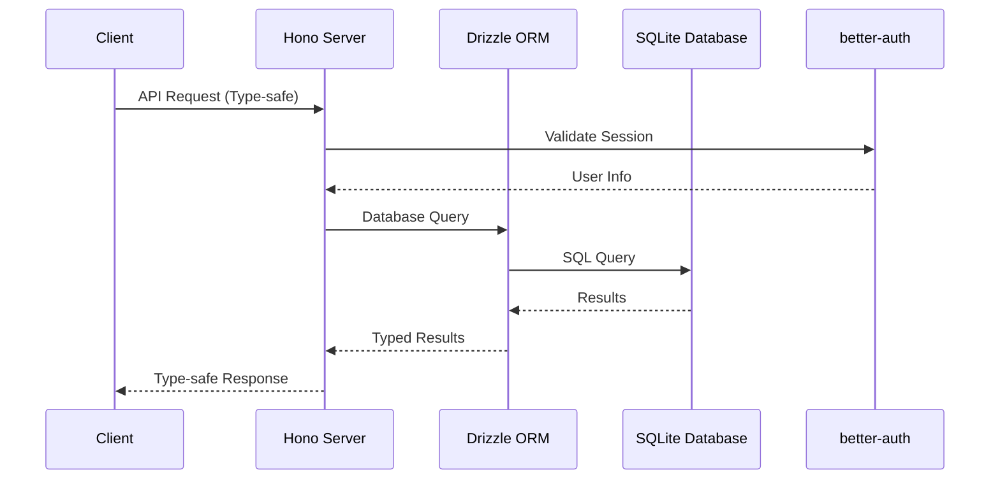

### API Endpoints Structure

```typescript
// Type-safe API routes
const routes = app
  .route('/auth', authRoutes)
  .route('/invoices', invoiceRoutes)
  .route('/payment-requests', paymentRequestRoutes)
  .route('/approvals', approvalRoutes)

export type AppType = typeof routes
```

## Database Schema Implementation

### Core Tables

#### Users & Authentication (better-auth generated)
```sql
-- Auto-generated by better-auth
CREATE TABLE user (
    id TEXT PRIMARY KEY,
    email TEXT UNIQUE NOT NULL,
    name TEXT NOT NULL,
    role TEXT NOT NULL DEFAULT 'user',
    emailVerified BOOLEAN DEFAULT FALSE,
    image TEXT,
    createdAt DATETIME DEFAULT CURRENT_TIMESTAMP,
    updatedAt DATETIME DEFAULT CURRENT_TIMESTAMP
);

CREATE TABLE session (
    id TEXT PRIMARY KEY,
    userId TEXT NOT NULL,
    expiresAt DATETIME NOT NULL,
    token TEXT UNIQUE NOT NULL,
    FOREIGN KEY (userId) REFERENCES user(id) ON DELETE CASCADE
);

CREATE TABLE account (
    id TEXT PRIMARY KEY,
    userId TEXT NOT NULL,
    accountId TEXT NOT NULL,
    providerId TEXT NOT NULL,
    accessToken TEXT,
    refreshToken TEXT,
    expiresAt DATETIME,
    FOREIGN KEY (userId) REFERENCES user(id) ON DELETE CASCADE
);
```

#### Business Domain Tables
```sql
CREATE TABLE invoices (
    id TEXT PRIMARY KEY,
    batch_id TEXT NOT NULL,
    amount DECIMAL(10,2) NOT NULL,
    invoice_date DATE NOT NULL,
    vendor TEXT NOT NULL,
    status TEXT NOT NULL CHECK (status IN ('imported', 'linked', 'completed', 'obsolete')),
    imported_by TEXT NOT NULL,
    metadata JSON,
    created_at DATETIME DEFAULT CURRENT_TIMESTAMP,
    updated_at DATETIME DEFAULT CURRENT_TIMESTAMP,
    FOREIGN KEY (imported_by) REFERENCES user(id)
);

CREATE TABLE payment_requests (
    id TEXT PRIMARY KEY,
    total_amount DECIMAL(10,2) NOT NULL,
    request_date DATE NOT NULL,
    status TEXT NOT NULL CHECK (status IN ('draft', 'in_review', 'approved', 'completed')),
    created_by TEXT NOT NULL,
    current_approver TEXT,
    approval_workflow JSON,
    created_at DATETIME DEFAULT CURRENT_TIMESTAMP,
    updated_at DATETIME DEFAULT CURRENT_TIMESTAMP,
    FOREIGN KEY (created_by) REFERENCES user(id),
    FOREIGN KEY (current_approver) REFERENCES user(id)
);

CREATE TABLE invoice_payment_requests (
    invoice_id TEXT NOT NULL,
    payment_request_id TEXT NOT NULL,
    linked_at DATETIME DEFAULT CURRENT_TIMESTAMP,
    PRIMARY KEY (invoice_id, payment_request_id),
    FOREIGN KEY (invoice_id) REFERENCES invoices(id) ON DELETE CASCADE,
    FOREIGN KEY (payment_request_id) REFERENCES payment_requests(id) ON DELETE CASCADE
);

CREATE TABLE approval_history (
    id TEXT PRIMARY KEY,
    payment_request_id TEXT NOT NULL,
    approver_id TEXT NOT NULL,
    action TEXT NOT NULL CHECK (action IN ('submitted', 'approved', 'rejected', 'changes_requested')),
    comments TEXT,
    created_at DATETIME DEFAULT CURRENT_TIMESTAMP,
    FOREIGN KEY (payment_request_id) REFERENCES payment_requests(id) ON DELETE CASCADE,
    FOREIGN KEY (approver_id) REFERENCES user(id)
);

CREATE TABLE business_process_logs (
    id TEXT PRIMARY KEY,
    process_index INTEGER NOT NULL,
    entity_type TEXT NOT NULL,
    entity_id TEXT NOT NULL,
    status TEXT NOT NULL CHECK (status IN ('started', 'completed', 'failed')),
    error_code TEXT,
    details JSON,
    created_at DATETIME DEFAULT CURRENT_TIMESTAMP
);
```

### Indexes for Performance
```sql
CREATE INDEX idx_invoices_status ON invoices(status);
CREATE INDEX idx_invoices_batch_id ON invoices(batch_id);
CREATE INDEX idx_payment_requests_status ON payment_requests(status);
CREATE INDEX idx_payment_requests_created_by ON payment_requests(created_by);
CREATE INDEX idx_approval_history_pr_id ON approval_history(payment_request_id);
CREATE INDEX idx_business_process_logs_entity ON business_process_logs(entity_type, entity_id);
CREATE INDEX idx_business_process_logs_process ON business_process_logs(process_index);
```

## Migration Strategy

### Migration Workflow

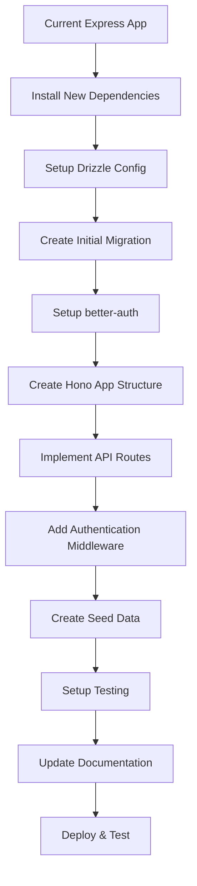

### Migration Commands
```bash
# Install dependencies
npm install hono drizzle-orm better-auth @hono/zod-validator zod

# Setup Drizzle
npx drizzle-kit generate:sqlite
npx drizzle-kit migrate

# Run seeds
npm run db:seed

# Run tests
npm run test
```

## Testing Strategy

### Test Structure

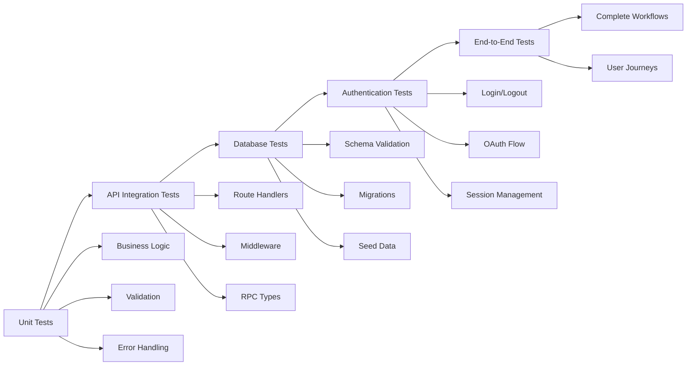

### Test Data Management

- **Fixtures**: Predefined test data for consistent testing
- **Factories**: Dynamic test data generation
- **Database Isolation**: Each test runs with clean database state
- **Mock External Services**: Mock payment systems and OAuth providers

## Deployment Considerations

### Environment Configuration

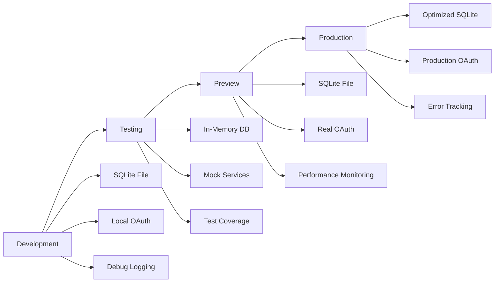

### Performance Optimizations

1. **Database Indexing**: Strategic indexes on frequently queried columns
2. **Connection Pooling**: Efficient database connection management
3. **Caching**: Redis for session and frequently accessed data
4. **Query Optimization**: Use Drizzle's query builder for efficient SQL
5. **Pagination**: Implement cursor-based pagination for large datasets

## Security Considerations

### Data Protection

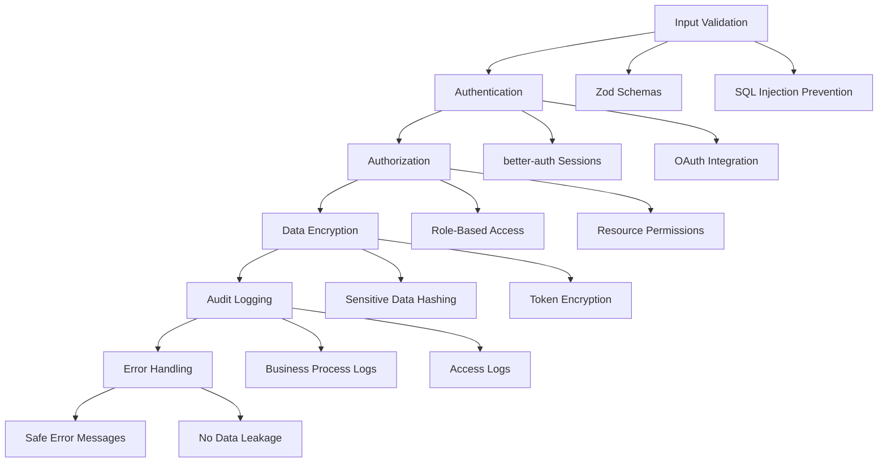

### Security Measures

1. **Input Validation**: Comprehensive validation using Zod schemas
2. **SQL Injection Prevention**: Parameterized queries via Drizzle ORM
3. **Authentication**: Secure session management with better-auth
4. **Authorization**: Role-based access control for all endpoints
5. **Data Encryption**: Sensitive data encryption at rest and in transit
6. **Audit Trail**: Complete logging of all business operations
7. **Error Handling**: Safe error messages without data leakage

## Monitoring & Observability

### Logging Strategy

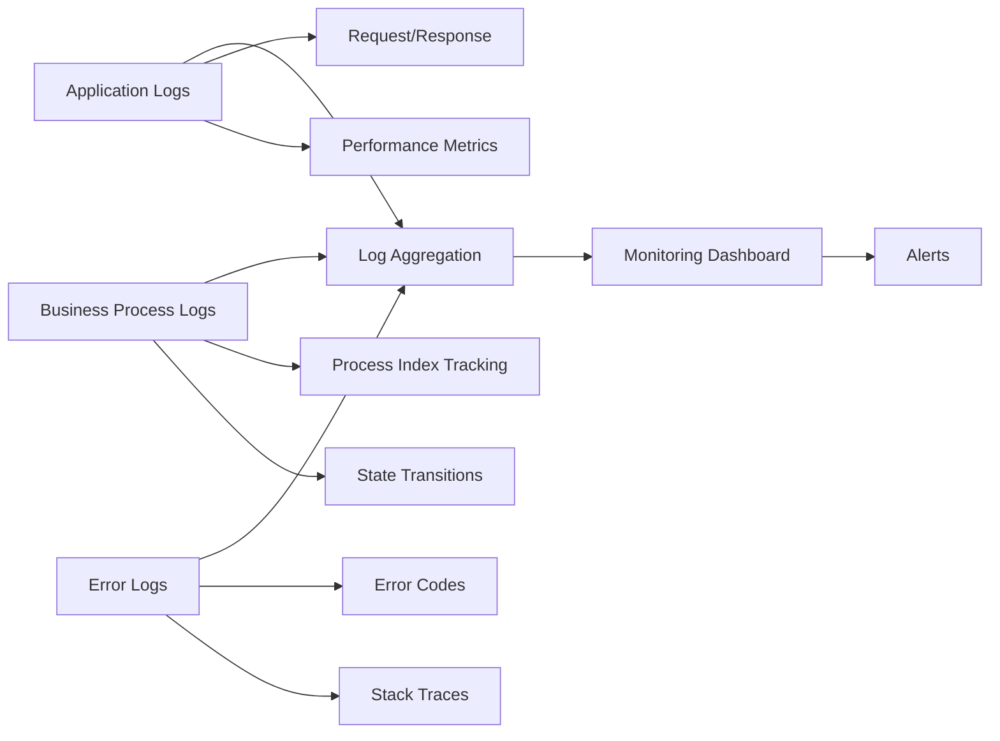

### Key Metrics

1. **Business Metrics**: Invoice processing rates, approval times, error rates
2. **Technical Metrics**: API response times, database query performance
3. **Security Metrics**: Failed authentication attempts, suspicious activities
4. **User Experience**: Page load times, user journey completion rates

## Next Steps

1. **Phase 1**: Setup tech stack and basic database schema
2. **Phase 2**: Implement authentication and core API endpoints
3. **Phase 3**: Add business logic and approval workflows
4. **Phase 4**: Create comprehensive test suite
5. **Phase 5**: Deploy to preview environment and gather feedback
6. **Phase 6**: Production deployment with monitoring

This implementation plan provides a solid foundation for building a modern, type-safe, and scalable invoice approval system that leverages the best practices in current web development.

