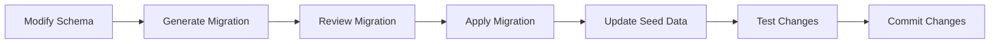
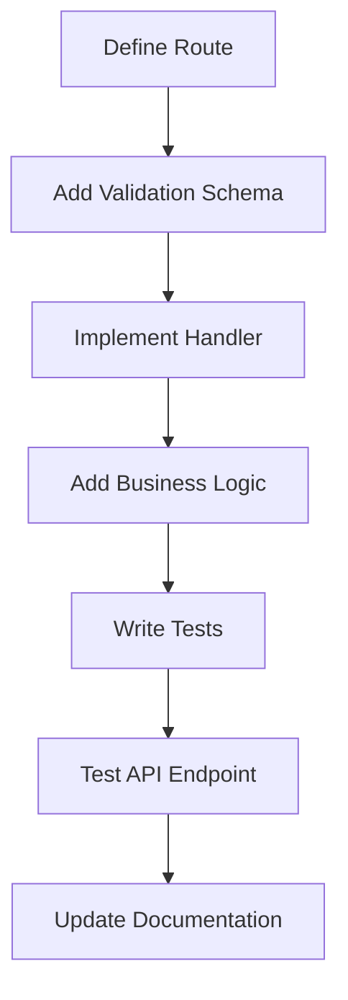

# Development Setup Guide

## Prerequisites

Before starting development, ensure you have the following installed:

- **Node.js**: v20.x or later
- **npm**: v10.x or later (comes with Node.js)
- **Git**: Latest version
- **VS Code**: Recommended IDE with extensions

### Recommended VS Code Extensions

```json
{
  "recommendations": [
    "bradlc.vscode-tailwindcss",
    "esbenp.prettier-vscode",
    "dbaeumer.vscode-eslint",
    "ms-vscode.vscode-typescript-next",
    "drizzle-team.drizzle-vscode",
    "hono.vscode-hono"
  ]
}
```

## Project Setup

### 1. Clone and Install Dependencies

```bash
# Clone the repository
git clone https://github.com/tini-works/tinker.git
cd tinker

# Install dependencies
npm install

# Install backend-specific dependencies
cd apps/backend
npm install
```

### 2. Environment Configuration

Create environment files for different environments:

#### Development Environment (`.env.development`)

```env
# Database
DATABASE_URL="file:./dev.db"

# better-auth Configuration
BETTER_AUTH_SECRET="your-secret-key-here"
BETTER_AUTH_URL="http://localhost:3000"

# Google OAuth (Development)
GOOGLE_CLIENT_ID="your-google-client-id"
GOOGLE_CLIENT_SECRET="your-google-client-secret"

# Application Settings
NODE_ENV="development"
PORT=3000
LOG_LEVEL="debug"

# Email Configuration (Optional for development)
SMTP_HOST="localhost"
SMTP_PORT=1025
SMTP_USER=""
SMTP_PASS=""
```

#### Testing Environment (`.env.test`)

```env
# Database (In-memory for tests)
DATABASE_URL=":memory:"

# better-auth Configuration
BETTER_AUTH_SECRET="test-secret-key"
BETTER_AUTH_URL="http://localhost:3001"

# Mock OAuth
GOOGLE_CLIENT_ID="mock-client-id"
GOOGLE_CLIENT_SECRET="mock-client-secret"

# Application Settings
NODE_ENV="test"
PORT=3001
LOG_LEVEL="error"
```

### 3. Database Setup

```bash
# Generate initial migration
npx drizzle-kit generate:sqlite

# Run migrations
npx drizzle-kit migrate

# Seed development data
npm run db:seed
```

## Tech Stack Configuration

### Hono.js Setup

Create the main server file:

```typescript
// apps/backend/src/index.ts
import { Hono } from 'hono';
import { cors } from 'hono/cors';
import { logger } from 'hono/logger';
import { authMiddleware } from './middleware/auth';
import { invoiceRoutes } from './routes/invoices';
import { paymentRequestRoutes } from './routes/payment-requests';
import { authRoutes } from './routes/auth';

const app = new Hono();

// Middleware
app.use('*', cors());
app.use('*', logger());

// Routes
app.route('/auth', authRoutes);
app.use('/api/*', authMiddleware); // Protect API routes
app.route('/api/invoices', invoiceRoutes);
app.route('/api/payment-requests', paymentRequestRoutes);

export default app;
export type AppType = typeof app;
```

### Drizzle ORM Configuration

```typescript
// apps/backend/drizzle.config.ts
import type { Config } from 'drizzle-kit';

export default {
  schema: './src/db/schema.ts',
  out: './drizzle/migrations',
  driver: 'sqlite',
  dbCredentials: {
    url: process.env.DATABASE_URL || 'file:./dev.db',
  },
  verbose: true,
  strict: true,
} satisfies Config;
```

### better-auth Configuration

```typescript
// apps/backend/src/lib/auth.ts
import { betterAuth } from 'better-auth';
import { drizzleAdapter } from 'better-auth/adapters/drizzle';
import { db } from '../db';

export const auth = betterAuth({
  database: drizzleAdapter(db, {
    provider: 'sqlite',
  }),
  socialProviders: {
    google: {
      clientId: process.env.GOOGLE_CLIENT_ID!,
      clientSecret: process.env.GOOGLE_CLIENT_SECRET!,
    },
  },
  emailAndPassword: {
    enabled: true,
    requireEmailVerification: false, // Set to true in production
  },
  session: {
    expiresIn: 60 * 60 * 24 * 7, // 7 days
    updateAge: 60 * 60 * 24, // 1 day
  },
});
```

## Development Workflow

### 1. Database Development



#### Commands

```bash
# Generate migration after schema changes
npx drizzle-kit generate:sqlite

# Apply migrations
npx drizzle-kit migrate

# Reset database (development only)
npm run db:reset

# Seed database
npm run db:seed

# View database in Drizzle Studio
npx drizzle-kit studio
```

### 2. API Development



#### Example Route Implementation

```typescript
// apps/backend/src/routes/invoices.ts
import { Hono } from 'hono';
import { zValidator } from '@hono/zod-validator';
import { z } from 'zod';
import { invoiceService } from '../services/invoice-service';

const invoiceRoutes = new Hono();

const createInvoiceSchema = z.object({
  batchId: z.string().min(1),
  invoices: z.array(
    z.object({
      amount: z.number().positive(),
      invoiceDate: z.string().date(),
      vendor: z.string().min(1),
      metadata: z.record(z.any()).optional(),
    })
  ),
});

invoiceRoutes.post(
  '/import',
  zValidator('json', createInvoiceSchema),
  async c => {
    const data = c.req.valid('json');
    const user = c.get('user');

    try {
      const result = await invoiceService.importInvoices(data, user.id);
      return c.json(result, 201);
    } catch (error) {
      return c.json({ error: error.message }, 400);
    }
  }
);

export { invoiceRoutes };
```

### 3. Testing Workflow

```bash
# Run all tests
npm test

# Run tests in watch mode
npm run test:watch

# Run tests with coverage
npm run test:coverage

# Run specific test file
npm test -- invoices.test.ts

# Run integration tests
npm run test:integration
```

### 4. Code Quality

```bash
# Lint code
npm run lint

# Fix linting issues
npm run lint:fix

# Format code
npm run format

# Type check
npm run type-check

# Run all quality checks
npm run quality-check
```

## Package.json Scripts

Add these scripts to your `apps/backend/package.json`:

```json
{
  "scripts": {
    "dev": "tsx watch src/index.ts",
    "build": "tsc",
    "start": "node dist/index.js",
    "test": "vitest",
    "test:watch": "vitest --watch",
    "test:coverage": "vitest --coverage",
    "test:integration": "vitest --config vitest.integration.config.ts",
    "lint": "eslint src --ext ts",
    "lint:fix": "eslint src --ext ts --fix",
    "format": "prettier --write src/**/*.ts",
    "type-check": "tsc --noEmit",
    "quality-check": "npm run lint && npm run type-check && npm run test",
    "db:generate": "drizzle-kit generate:sqlite",
    "db:migrate": "drizzle-kit migrate",
    "db:studio": "drizzle-kit studio",
    "db:seed": "tsx src/db/seed.ts",
    "db:reset": "rm -f dev.db && npm run db:migrate && npm run db:seed"
  }
}
```

## Testing Setup

### Vitest Configuration

```typescript
// apps/backend/vitest.config.ts
import { defineConfig } from 'vitest/config';
import path from 'path';

export default defineConfig({
  test: {
    globals: true,
    environment: 'node',
    setupFiles: ['./src/test/setup.ts'],
    coverage: {
      provider: 'v8',
      reporter: ['text', 'json', 'html'],
      exclude: ['node_modules/', 'src/test/', 'drizzle/', '**/*.d.ts'],
    },
  },
  resolve: {
    alias: {
      '@': path.resolve(__dirname, './src'),
    },
  },
});
```

### Test Setup

```typescript
// apps/backend/src/test/setup.ts
import { beforeEach, afterEach } from 'vitest';
import { db } from '../db';
import { migrate } from 'drizzle-orm/sqlite/migrator';

beforeEach(async () => {
  // Reset database for each test
  await migrate(db, { migrationsFolder: './drizzle/migrations' });
});

afterEach(async () => {
  // Clean up after each test
  await db.delete(users);
  await db.delete(invoices);
  await db.delete(paymentRequests);
});
```

### Example Test

```typescript
// apps/backend/src/test/invoices.test.ts
import { describe, it, expect } from 'vitest';
import { testClient } from './utils';
import { createTestUser } from './fixtures/users';

describe('Invoice API', () => {
  it('should import invoices successfully', async () => {
    const user = await createTestUser();
    const client = testClient(user);

    const response = await client.invoices.import.$post({
      json: {
        batchId: 'test-batch-001',
        invoices: [
          {
            amount: 1000.0,
            invoiceDate: '2024-01-15',
            vendor: 'Test Vendor',
          },
        ],
      },
    });

    expect(response.status).toBe(201);
    const data = await response.json();
    expect(data.success).toBe(true);
    expect(data.invoices).toHaveLength(1);
  });
});
```

## Debugging

### VS Code Debug Configuration

```json
// .vscode/launch.json
{
  "version": "0.2.0",
  "configurations": [
    {
      "name": "Debug Backend",
      "type": "node",
      "request": "launch",
      "program": "${workspaceFolder}/apps/backend/src/index.ts",
      "outFiles": ["${workspaceFolder}/apps/backend/dist/**/*.js"],
      "runtimeArgs": ["-r", "tsx/cjs"],
      "env": {
        "NODE_ENV": "development"
      },
      "console": "integratedTerminal",
      "internalConsoleOptions": "neverOpen"
    },
    {
      "name": "Debug Tests",
      "type": "node",
      "request": "launch",
      "program": "${workspaceFolder}/node_modules/vitest/vitest.mjs",
      "args": ["run", "--reporter=verbose"],
      "cwd": "${workspaceFolder}/apps/backend",
      "console": "integratedTerminal",
      "internalConsoleOptions": "neverOpen"
    }
  ]
}
```

### Logging Configuration

```typescript
// apps/backend/src/lib/logger.ts
import { createLogger, format, transports } from 'winston';

const logger = createLogger({
  level: process.env.LOG_LEVEL || 'info',
  format: format.combine(
    format.timestamp(),
    format.errors({ stack: true }),
    format.json()
  ),
  defaultMeta: { service: 'invoice-approval-backend' },
  transports: [
    new transports.File({ filename: 'logs/error.log', level: 'error' }),
    new transports.File({ filename: 'logs/combined.log' }),
  ],
});

if (process.env.NODE_ENV !== 'production') {
  logger.add(
    new transports.Console({
      format: format.combine(format.colorize(), format.simple()),
    })
  );
}

export { logger };
```

## Common Development Tasks

### Adding a New API Endpoint

1. **Define the route schema**:

```typescript
const newEndpointSchema = z.object({
  // Define your schema
});
```

2. **Implement the route handler**:

```typescript
app.post('/new-endpoint', zValidator('json', newEndpointSchema), async c => {
  // Implementation
});
```

3. **Add business logic**:

```typescript
// In service layer
export const newService = {
  async handleNewEndpoint(data: NewEndpointData) {
    // Business logic
  },
};
```

4. **Write tests**:

```typescript
describe('New Endpoint', () => {
  it('should handle new endpoint correctly', async () => {
    // Test implementation
  });
});
```

### Adding a New Database Table

1. **Update schema**:

```typescript
// In src/db/schema.ts
export const newTable = sqliteTable('new_table', {
  id: text('id').primaryKey(),
  // Other columns
});
```

2. **Generate migration**:

```bash
npx drizzle-kit generate:sqlite
```

3. **Apply migration**:

```bash
npx drizzle-kit migrate
```

4. **Update seed data**:

```typescript
// In src/db/seed.ts
await db.insert(newTable).values([
  // Seed data
]);
```

## Troubleshooting

### Common Issues

1. **Database locked error**:
   - Stop all running processes
   - Delete `dev.db` and regenerate

2. **Type errors after schema changes**:
   - Regenerate migrations
   - Restart TypeScript server in VS Code

3. **Authentication not working**:
   - Check environment variables
   - Verify OAuth configuration
   - Check session cookies

4. **Tests failing**:
   - Ensure test database is clean
   - Check test fixtures
   - Verify mock data

### Performance Monitoring

```typescript
// Add to your routes for performance monitoring
app.use('*', async (c, next) => {
  const start = Date.now();
  await next();
  const duration = Date.now() - start;

  if (duration > 1000) {
    logger.warn(
      `Slow request: ${c.req.method} ${c.req.url} took ${duration}ms`
    );
  }
});
```

This development setup guide provides everything needed to get started with the modern invoice approval system development.
