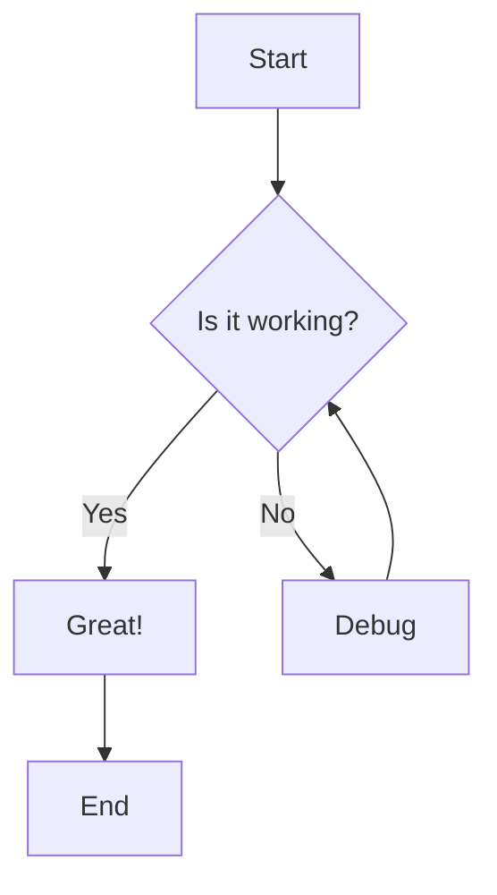
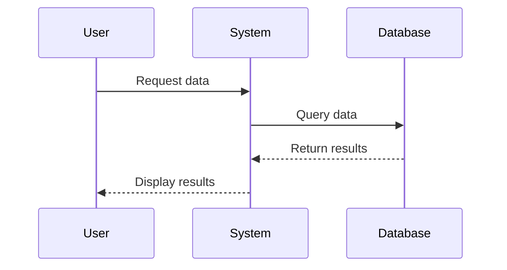
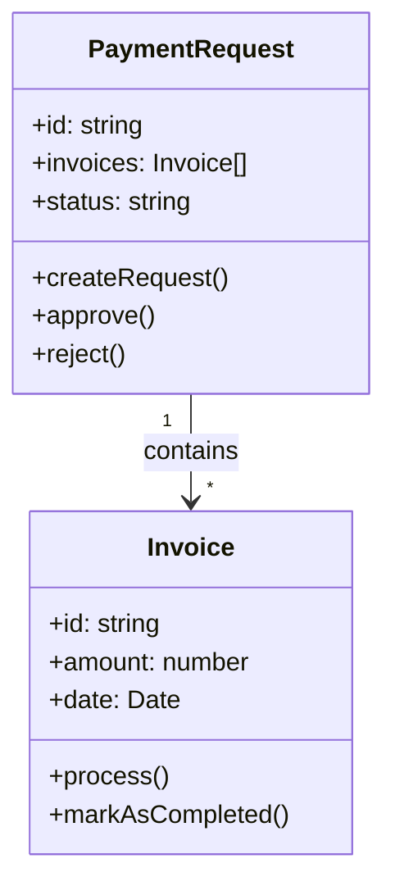
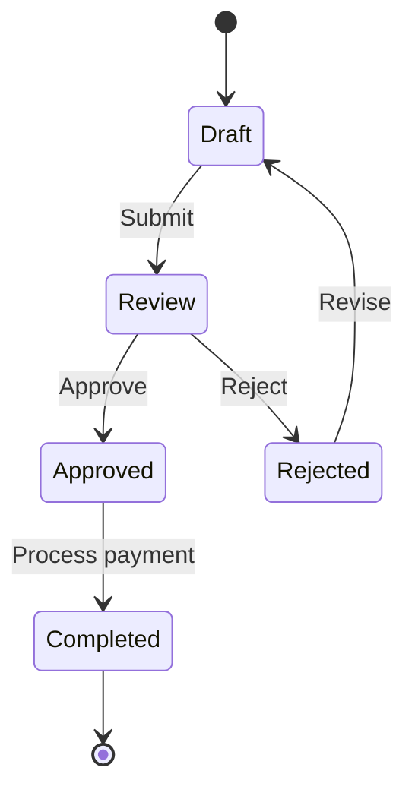
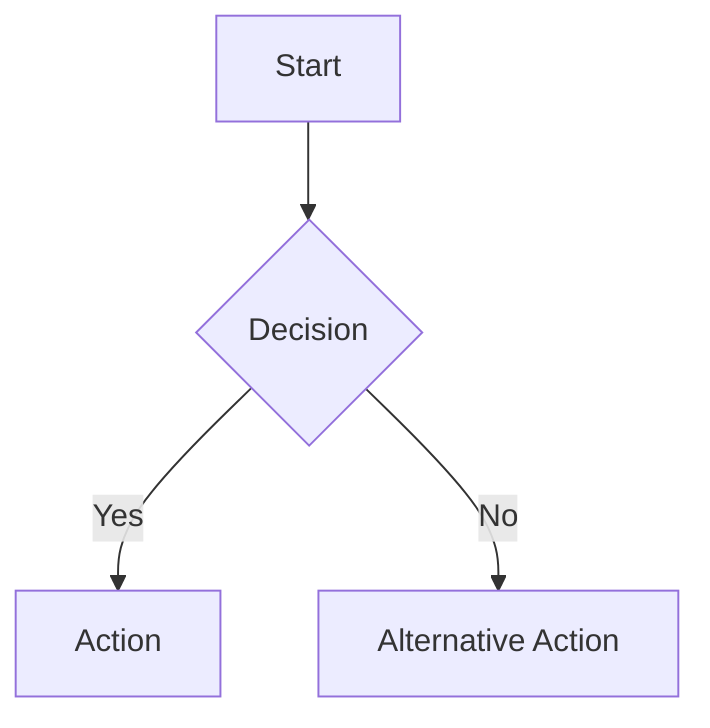

# Mermaid Diagram Examples

This page demonstrates how to use Mermaid diagrams in your documentation.

## Flow Chart Example



## Sequence Diagram Example



## Class Diagram Example



## State Diagram Example



## How to Use Mermaid in Your Documentation

To create a Mermaid diagram, use the following syntax:

````markdown

````

For more information on Mermaid syntax, visit the [Mermaid documentation](https://mermaid.js.org/intro/).

