# Technical Architecture: Modern Invoice Approval System

## System Overview

This document provides detailed technical architecture for the invoice approval system migration from Express.js to a modern, type-safe stack.

## High-Level Architecture

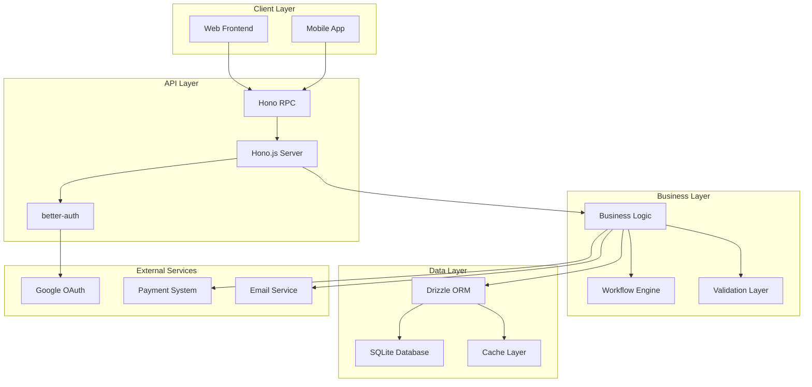

## Technology Stack Deep Dive

### Hono.js Framework

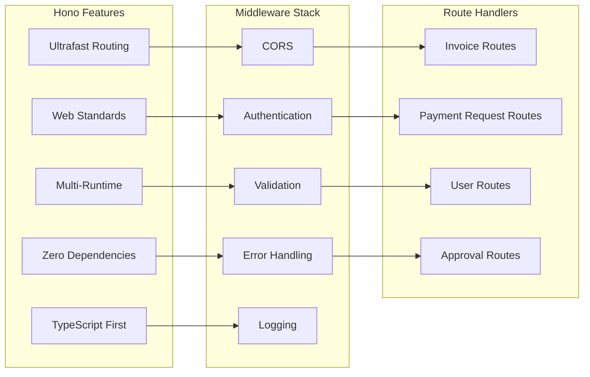

### Drizzle ORM Architecture

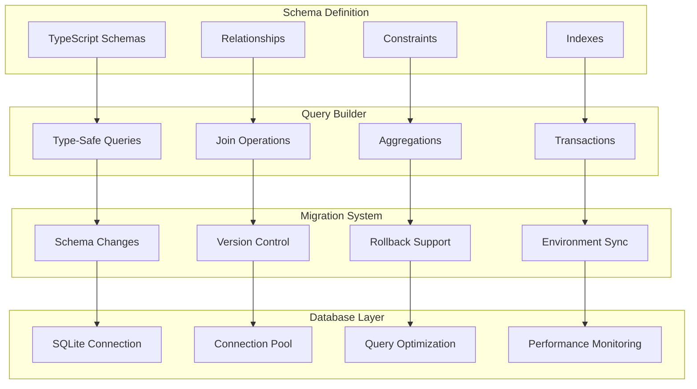

## Authentication Flow

### better-auth Integration

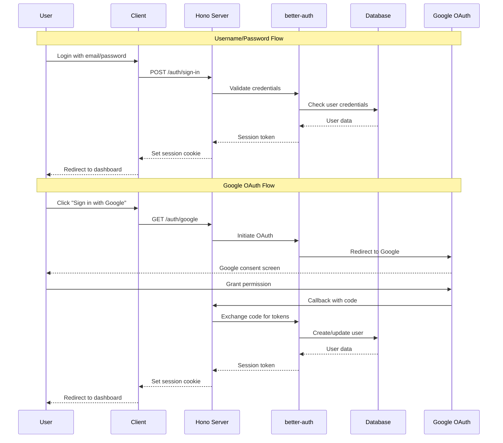

### Session Management

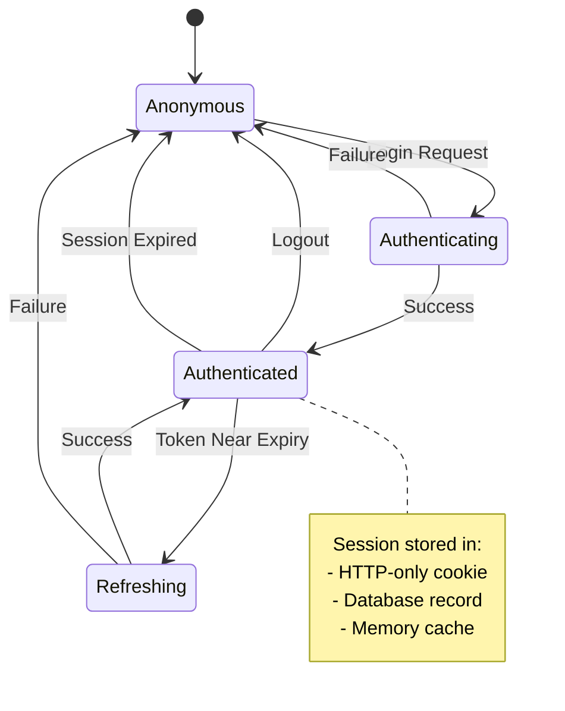

## Business Process Workflow

### Invoice Processing Pipeline

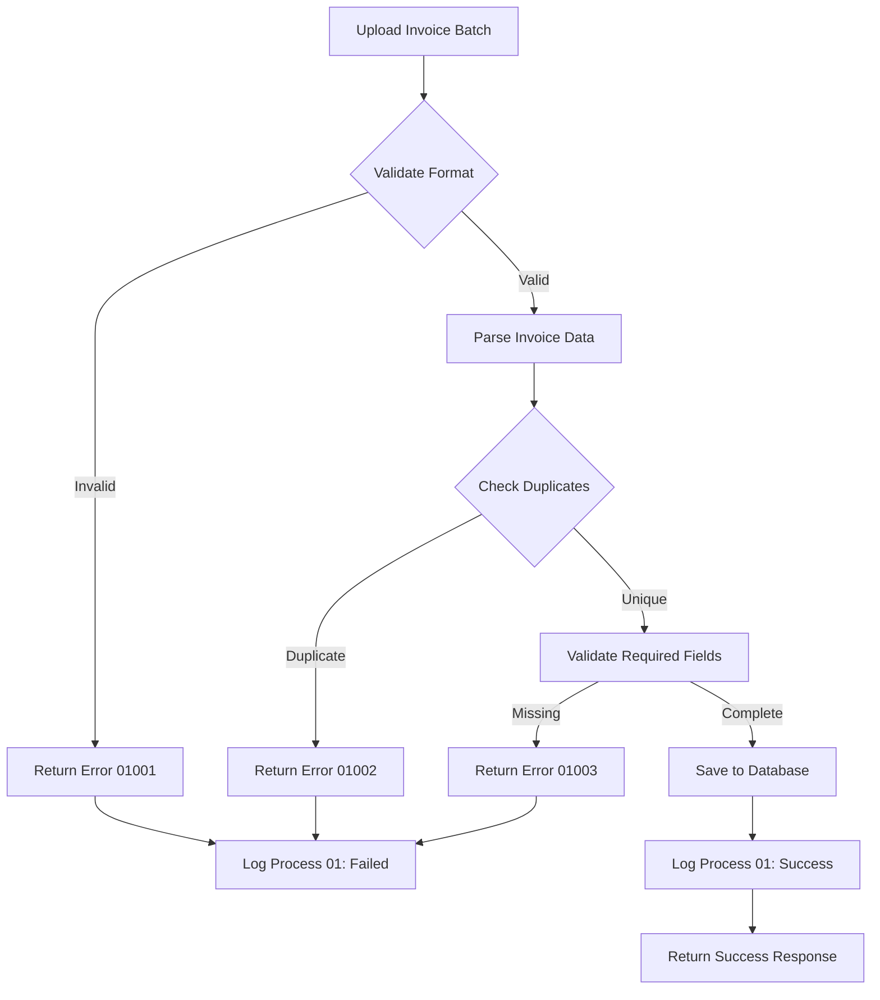

### Payment Request Approval Workflow

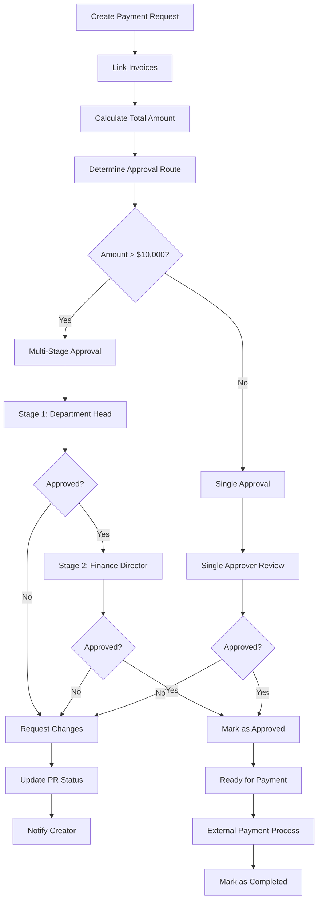

## Data Flow Architecture

### Request Processing Flow

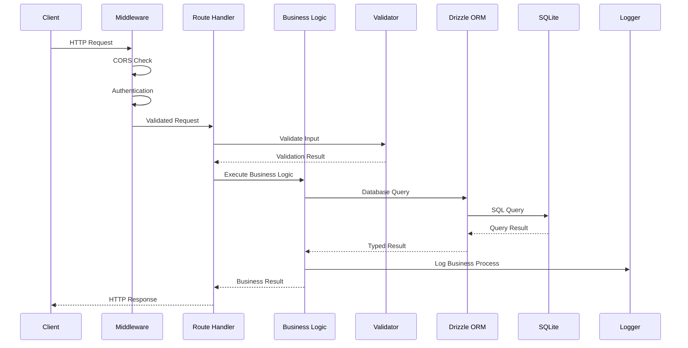

### Error Handling Flow

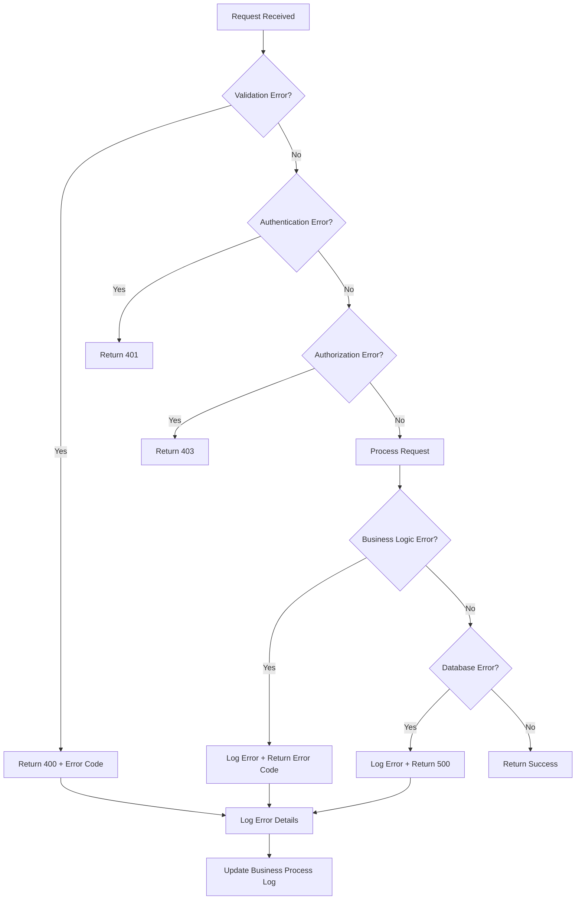

## Database Design Details

### Entity Relationships

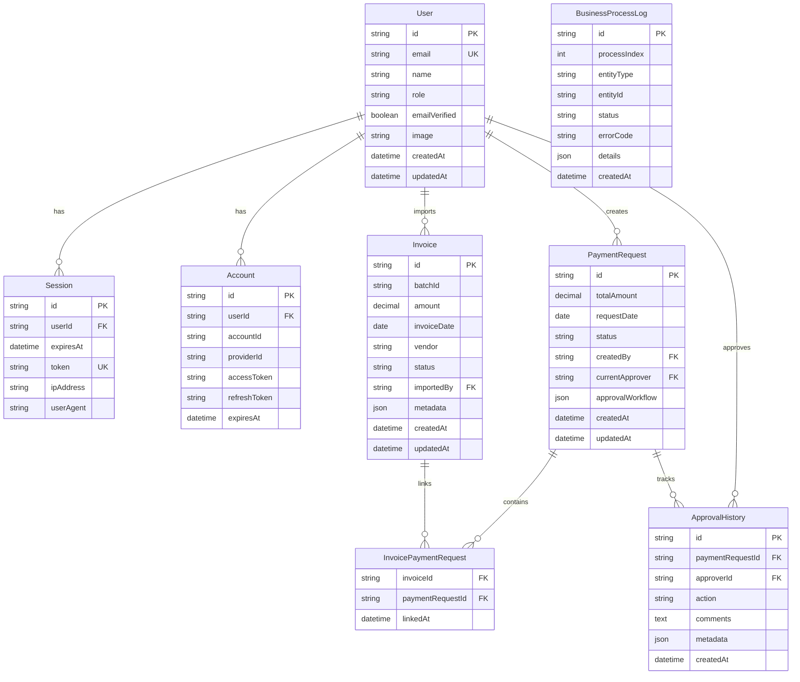

### Database Constraints and Triggers

```sql
-- Ensure invoice amounts are positive
ALTER TABLE invoices ADD CONSTRAINT chk_invoice_amount_positive
CHECK (amount > 0);

-- Ensure payment request total matches linked invoices
CREATE TRIGGER update_payment_request_total
AFTER INSERT ON invoice_payment_requests
BEGIN
    UPDATE payment_requests
    SET total_amount = (
        SELECT SUM(i.amount)
        FROM invoices i
        JOIN invoice_payment_requests ipr ON i.id = ipr.invoice_id
        WHERE ipr.payment_request_id = NEW.payment_request_id
    )
    WHERE id = NEW.payment_request_id;
END;

-- Audit trail trigger
CREATE TRIGGER audit_payment_request_changes
AFTER UPDATE ON payment_requests
BEGIN
    INSERT INTO business_process_logs (
        process_index, entity_type, entity_id, status, details, created_at
    ) VALUES (
        CASE
            WHEN NEW.status = 'in_review' THEN 4
            WHEN NEW.status = 'approved' THEN 8
            WHEN NEW.status = 'completed' THEN 10
        END,
        'payment_request',
        NEW.id,
        'completed',
        json_object('old_status', OLD.status, 'new_status', NEW.status),
        CURRENT_TIMESTAMP
    );
END;
```

## API Design

### Hono RPC Type Definitions

```typescript
// Shared types between client and server
export interface InvoiceCreateRequest {
  batchId: string;
  invoices: {
    amount: number;
    invoiceDate: string;
    vendor: string;
    metadata?: Record<string, any>;
  }[];
}

export interface PaymentRequestCreateRequest {
  invoiceIds: string[];
  requestDate: string;
  approvalWorkflow?: {
    stages: {
      approverId: string;
      order: number;
    }[];
  };
}

// API route definitions
const invoiceRoutes = new Hono()
  .post('/import', zValidator('json', invoiceCreateSchema), async c => {
    // Implementation
  })
  .get('/:id', async c => {
    // Implementation
  });

const paymentRequestRoutes = new Hono()
  .post('/', zValidator('json', paymentRequestCreateSchema), async c => {
    // Implementation
  })
  .post('/:id/submit', async c => {
    // Implementation
  })
  .post('/:id/approve', async c => {
    // Implementation
  });

// Export type for client
export type AppType = typeof app;
```

### Client-Side Usage

```typescript
import { hc } from 'hono/client';
import type { AppType } from '../server/app';

const client = hc<AppType>('http://localhost:3000');

// Type-safe API calls
const response = await client.invoices.import.$post({
  json: {
    batchId: 'batch-001',
    invoices: [
      {
        amount: 1000.0,
        invoiceDate: '2024-01-15',
        vendor: 'Acme Corp',
      },
    ],
  },
});

if (response.ok) {
  const data = await response.json(); // Fully typed
}
```

## Performance Considerations

### Database Optimization

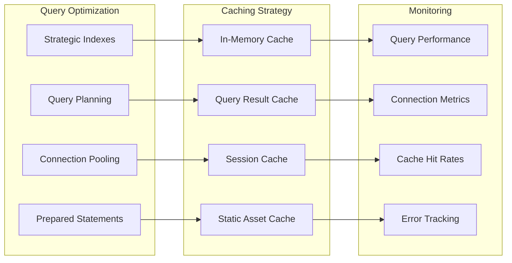

### Scalability Patterns

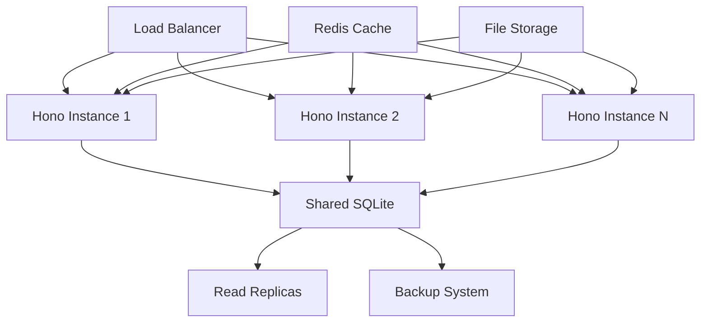

## Security Architecture

### Defense in Depth

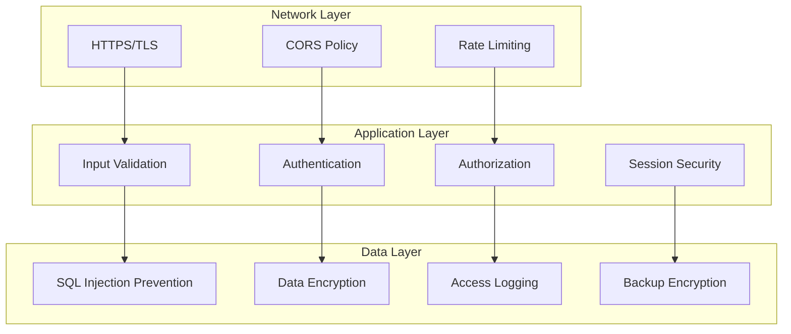

### Threat Model

| Threat               | Mitigation            | Implementation           |
| -------------------- | --------------------- | ------------------------ |
| SQL Injection        | Parameterized Queries | Drizzle ORM              |
| XSS                  | Input Sanitization    | Zod Validation           |
| CSRF                 | Token Validation      | better-auth              |
| Session Hijacking    | Secure Cookies        | HTTP-only, Secure flags  |
| Data Breach          | Encryption            | At-rest and in-transit   |
| Privilege Escalation | Role-based Access     | Authorization middleware |

## Deployment Architecture

### Environment Strategy

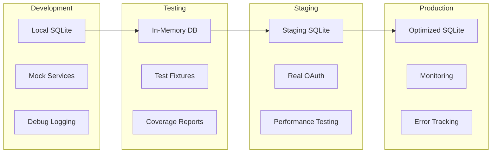

### CI/CD Pipeline

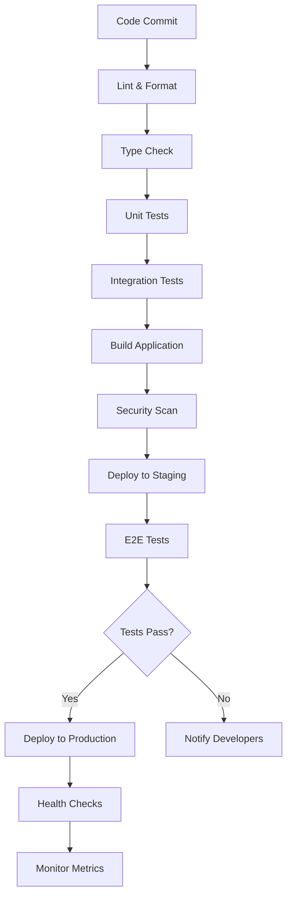

This technical architecture provides a comprehensive foundation for building a modern, scalable, and secure invoice approval system using the latest web development technologies and best practices.
